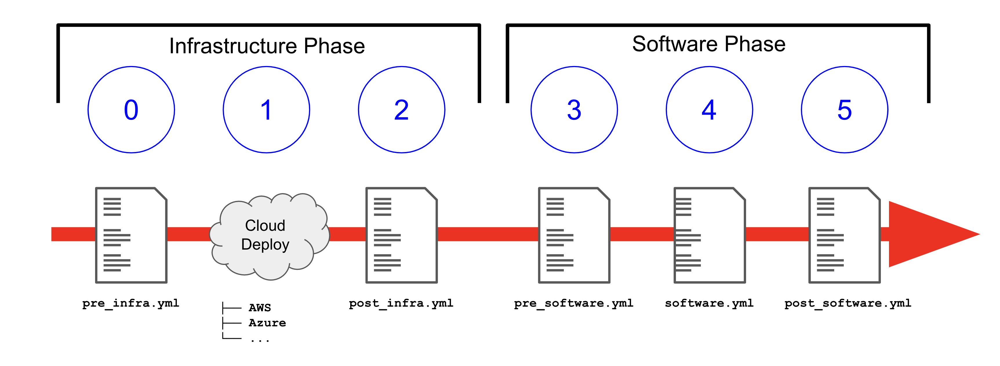

== Overview

Ansible Agnostic Deployer, AKA *AAD*, AKA *AgnosticD*, is a fully automated 2
 Phase deployer for building and deploying everything from basic infrastructure 
  to fully configured running application environments running on either public
   Cloud Providers or OpenShift clusters.

*AgnosticD* is not an OpenShift Deployer, though it can and does that, it is
 however also a deployer that just happens to be used to deploy a lot of
  OpenShift and OpenShift workloads, amongst other things. 

=== Make your first Deployment

There are many link:./ansible/configs[configs] you can choose from, here are two
 that you can start with and modify to fit your needs:

* link:./ansible/configs/three-tier-app/README.adoc[Three Tier App] - Relatively 
 simple environment, which deploys by default just a bunch of Linux hosts ready
  to be configured.

* link:./ansible/configs/ocp-workshop/README.adoc[OCP Workshop] - If a fully
 installed OpenShift Cluster is what you are looking for then take a look here.

* link:./ansible/roles/ocp-workload-3scale-multitenant/readme.adoc[OpenShift 3Scale
 Deployment] - Want to deploy a workload onto your existing OpenShift Cluster? 
  or local instance running on your laptop?  3Scale is an example of one of
   around *30* OpenShift workloads ready to go.

=== How AgnosticD Deploys

* For OpenShift _Workloads_ *AgnosticD* executes an ansible *role* against an
 existing OpenShift cluster. Roles can be found link:./ansible/roles/[here] and
  begin `ocp-workload-*`.

* For _Configs_ each contain 5 deployment playbooks and supporting files executed 
 in sequence and combined with a Cloud Provider to deploy basic infrastructure 
  through to fully configured applications.

.AgnosticD deployment workflow

=== Getting Started

The accompanying documentation explains how to achieve all this, extend it and 
 add both your own environments, hereafter called _configs_ and a lot lot more.
Well designed _configs_, can be easily abstracted to allow deployment to multiple
 different Public and Private Clouds including AWS, Azure, and others.

* link:./docs/[The Documentation Set] Start Here
* link:./ansible/[./ansible] The working ansible directory
** link:./ansible/main.yml[main.yml] The main entry point for `ansible-playbook`
* link:./ansible/roles[Roles directory] Home to the `ocp-workload-*` roles
* link:./ansible/configs[Configs directory] Home to the _Configs_

The Contributors Guides explore the relevant structures in significantly more detail:

* link:docs/Creating_an_OpenShift_Workload.adoc[Creating an OpenShift Workload Guide]
* link:docs/Creating_a_config.adoc[Creating a Config Guide]
// * link:docs/Creating_a_cloud_deployer.adoc[Creating a Cloud Deployer Guide]

