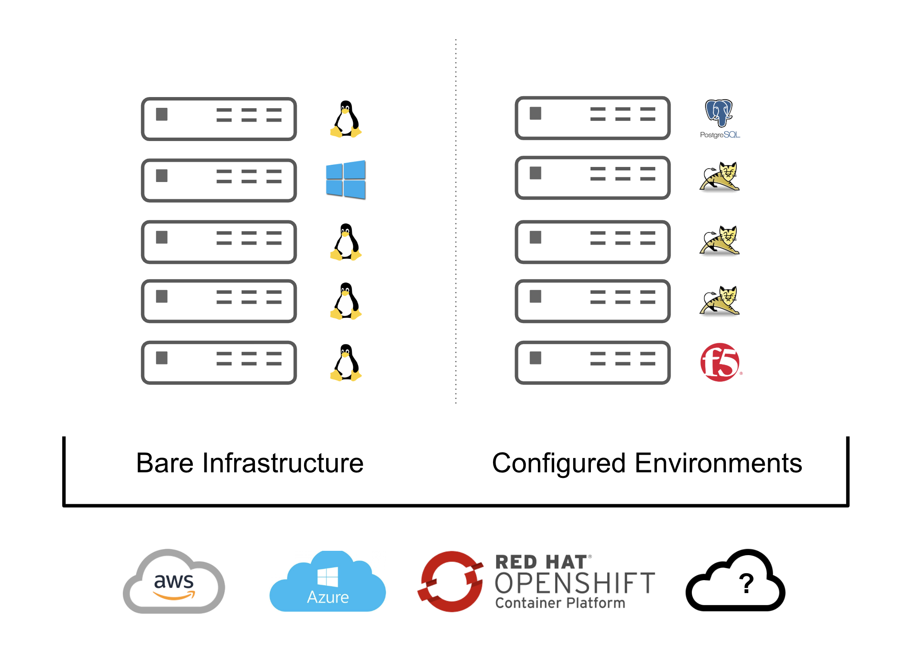

== Overview

Ansible Agnostic Deployer, referred to from now on as *AgnosticD*, is a 2 Phase deployer for building and deploying both Cloud Infrastructure *AND* and OpenShift based  deployments.

*AgnosticD* fully automates these cloud deployments from simple basic infrastructures, aka _"a bunch of Linux and Windows VMs in the cloud*_ through to fully configured applications for example load balancers connected to app servers connected to databases connected to... 

For OpenShift it can deploy both empty, but fully configured, Highly Available clusters through to the latest and greatest buzz word compliant MicroServices Distributed Application Architectures...

=== Getting Started 

The accompanying documentation explains how to achieve all this, extend it and add both your own environments, hereafter called _configs_ and a lot lot more.
Well designed _configs_, can be easily abstracted to allow deployment to multiple different Public and Private Clouds including AWS, Azure, and others.

* `./docs/` Start here
* `./ansible` The execution environment
* `./ansible/main.yml` The entry point for a deployment
* `./ansible/configs` Home to the _configs_ to deploy

The Contributors Guides explore the relevant structures in significantly more detail:

* link:docs/Creating_a_config.adoc[Creating a Config Guide]
* link:docs/Creating_a_cloud_deployer.adoc[Creating a Cloud Deployer Guide]
