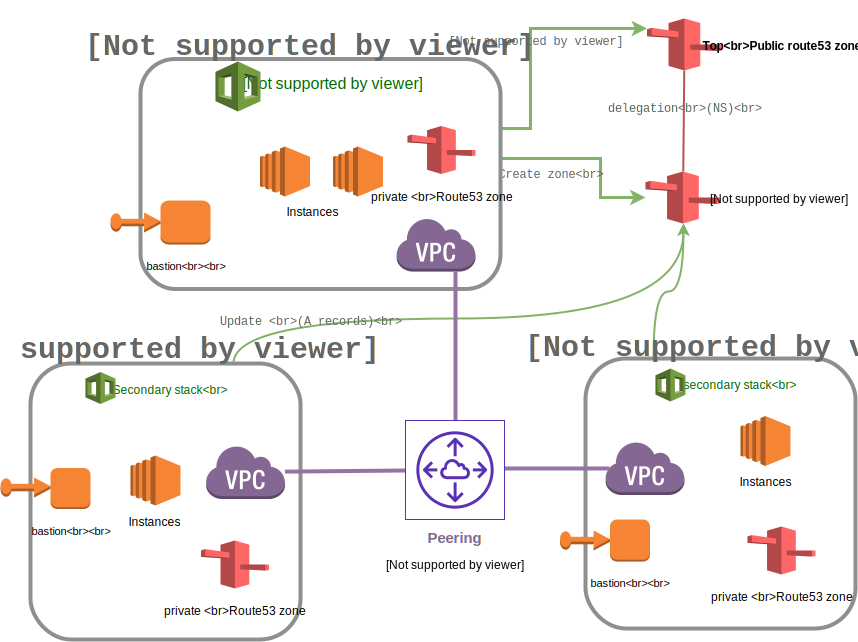

= Multi-region example

This config is an example of multi-region deployment.

. You specify the target regions using the `target_regions` variable, for example:
+
[source,yaml]
----
target_regions:
  - region: us-east-1
    stack: default
    name: na
  - region: eu-central-1
    stack: default
    name: emea
  - region: ap-southeast-1
    stack: default
    name: apac
----
+
This will deploy the same stack (default) in the specified regions. The default CloudFormation template is used: either in the config dir, or the default cloudformation template if there is none in the config dir.
+
If you want to use a specific template in a region, just specify the file name and store the template in `configs/multi-region-example/files/cloud_providers/FILENAME`.
+
.example with files/cloud_providers/europe.j2 for emea
[source,yaml]
----
target_regions:
  - region: us-east-1
    stack: default
    name: na
  - region: eu-central-1
    stack: europe.j2
    name: emea
----

Have a look at link:sample_vars.yml[] too for example vars.

