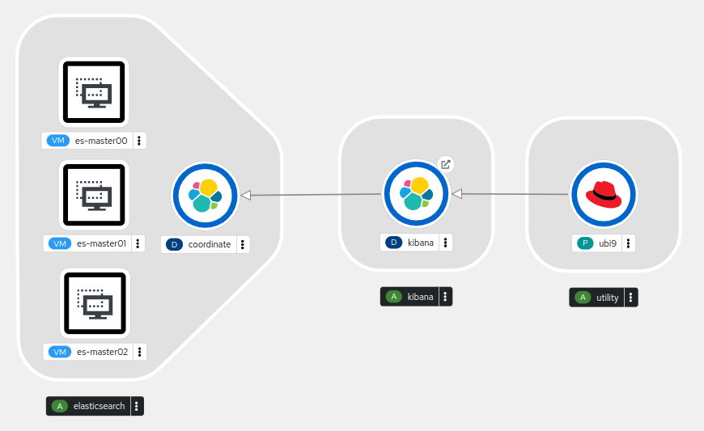

Openshift Virtualization Demo running Elasticsearch on Mixed Pods (VMs and Containers)



### Dependencies:
* OpenShift Baremetal cluster with ODF
  * for instance: demo.redhat.com - Hands on with Openshift Virtualization
  * ODF is default storage class set and profile applied
* Installed Operators
  * OpenShift Virtualization Operator
  * Cert Utils Operator
* RHEL Subscription information (for Pod software installation) 
  * Subscription Org
  * Subscription Key

### Setup
NOTE: Setup is ran from the desired bastion host for the OCP cluster(s)
```sh
sudo dnf install -y git
git clone https://github.com/purefield/opc-virt.git ~/demo
cd ~/demo/
./setup.sh
```

### Demo Prep
Log into the OpenShift Cluster

Run the demo script from the same bastion to create a fresh elasticsearch cluster in a new namespace (first argument or prompt, defaults to last namespace used or ```next-gen-virt```)
```sh
cd elasticsearch/
./generate-yaml.sh next-gen-virt
oc apply -f next-gen-virt.yaml
```
Wait for installation (approximately 4 mins in normal circumstances)

Once the VMs are running, execute:
```
watch --color ./demo.sh
```

### Demo Highlights
Under Administrator Perspective:
* Operators -> OperatorHub
  * OpenShift Virtualization Operator (installed)
  * Migration Toolkit for Virtualization Operator (available)
* Virtualization
  * Overview
  * Templates
  * DataStore (RWX)
  * Catalog
  * VirtualMachines
    * Create
      * With Wizard
        * Create
          * Select Red Hat Enterprise Linux 9.0 VM
          * Next
            * Create virtual machine
    * [... menu] Migrate Node to Node
    * [New VM] Overview
      * Virtual Machine options
      * Metrics
      * Snapshots
* Run demo steps 
  * Pick random/suggested name for namespace to pass as first argument or when prompted
  * Execute generate and apply steps in shared terminal window showing VirtualMachines screen in the background 

Under the Developer Perspective:
* Topology
  * Show the mixed environment and dig into details

Under Administrator Perspective:
* Networking
   * Routes
     * Select es-master00 Cockpit route
       * Log-in using ```elasticsearch```:```redhat```
         * View services and search for elasticsearch (will appear when ready)
     * Select elasticsearch route
       * Verify ```cluster_uuid``` is populated
       * Append ```/_cat/nodes``` to elasticsearch url and verify ```coordinate``` is a member
     * Open kibana route to show connected web application
* Virtualization
  * VirtualMachines
    * es-master00
      * Environment
        * Configuration Maps mounted inside the VM
          * 00yaml - Elasticsearch Node specific configuration
          * 0000sh - Multiple scripts used during VM installation
        * Secret mounted inside the VM
          * 00cert - Let's Encrypt SSL Certificate private key and chain used by the VMs
    * Migrate VM from Node to Node
    * Take a Snapshot of the VM
