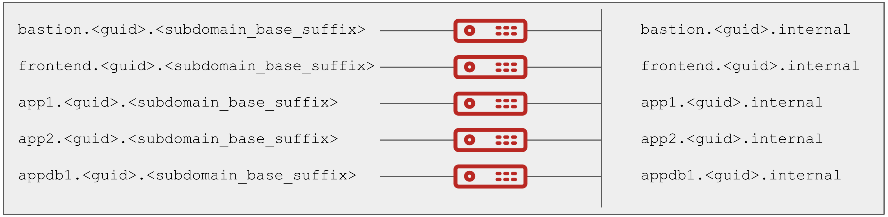

== Overview

This template is derived from [*Three Tier App* _config_](../three-tier-app/README.adoc) 
It is worth noting, despite its name, that no application is actually deployed.
It makes an ideal base infrastructure to build on and can easily be extended via it's `env_vars.yml` to less or more machines and also to different operating system images.

Custom jinja2 template for OpenStack nvironment is added at configs/pntae-app/files/cloud_providers/osp_cloud_template_master.j2 
This supports multiple networks per instance and also aiming to support the custoization options as in Ravello environment.

== Supported Cloud Providers

* OpenStack

== Add multiple networks:

To add multiple networks, append the block like network01 network02 in below example:
 
----
networks:
  - name: default
    shared: "false"
    subnet_cidr: 192.98.99.0/24
    gateway_ip: 192.98.99.1
    allocation_start: 192.98.99.10
    allocation_end: 192.98.99.254
    dns_nameservers: []
    create_router: true
  - name: network01
    shared: "false"
    subnet_cidr: 172.78.79.0/24
    gateway_ip: 172.78.79.1
    allocation_start: 172.78.79.10
    allocation_end: 172.78.79.254
    dns_nameservers: []
    create_router: true
  - name: network02
    shared: "false"
    subnet_cidr: 182.88.89.0/24
    gateway_ip: 182.88.89.1
    allocation_start: 182.88.89.10
    allocation_end: 182.88.89.254
    dns_nameservers: []
    create_router: true
----

== Add instances with multiple networks attached to it

Particular network can be attached to an instance by providing it's name in __network:__ configuration.
Mltiple networks can be attached by appending the name in list form.

Set the __floating_ip__ option to __true__ to have an instance with floating ip associated with it.
When there are multiple networks attached to a particualr instance, first network name mentioned in the list will have floating ip associated with it.

Refer below example for details:

----
  - name: "frontend"
    count: "{{frontend_instance_count}}"
    public_dns: true
    floating_ip: true
    dns_loadbalancer: true
    image_id: "{{ frontend_instance_image }}"
    flavor:
      ec2: "{{frontend_instance_type}}"
      osp: "{{frontend_instance_type}}"
      azure: "Standard_A2_V2"
    tags:
      - key: "AnsibleGroup"
        value: "frontends"
      - key: "ostype"
        value: "linux"
      - key: "instance_filter"
        value: "{{ env_type }}-{{ email }}"
    security_groups:
      - DefaultSG
      - BastionSG
    networks:
      - network02
      - network01

  - name: "app"
    count: "{{app_instance_count}}"
    public_dns: false
    image_id: "{{ app_instance_image }}"
    flavor:
      ec2: "{{app_instance_type}}"
      osp: "{{app_instance_type}}"
      azure: "Standard_A2_V2"
    tags:
      - key: "AnsibleGroup"
        value: "apps"
      - key: "ostype"
        value: "rhel"
      - key: "instance_filter"
        value: "{{ env_type }}-{{ email }}"
    key_name: "{{key_name}}"
    security_groups:
      - DefaultSG
    networks:
      - network02
      - network01
----

Above configuration example denotes creation of three networks, default, network01 and network02.
Two instances are created here, frontend and app.
Both the instances are attached to two networks, network01 and network02
Frontend instance has public ip and is associated with network02.

== Sample config location:

----
configs/pntae-app/sample_vars/2-private-dns-osp.yml
----

== Launch and delete stack:

----
$ ansible-playbook main.yml -e @configs/pntae-app/sample_vars/2-private-dns-osp.yml  -e @~/secret.yml
$ ansible-playbook destroy.yml -e @configs/pntae-app/sample_vars/2-private-dns-osp.yml  -e @~/secret.yml
----

