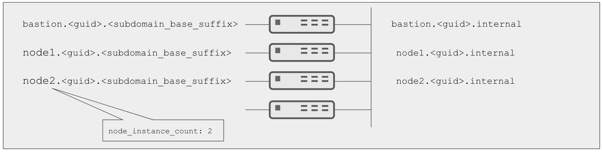

= Just a Bunch of Nodes Example

== Overview

PNTAE Training's *just-abunch-of-nodes* configuration. 
This can be used to create basic courses involving a few rhel vms and one bastion node.
This config pulls PNTAE training's customization scripts from github.

*just-a-bunch-of-nodes* _config_  whilst originally intended for the deployment of instances, is perhaps better described as "N un-configured RHEL machines all exposed to the internet".
It is worth noting, despite its name, that no application is actually deployed.
It makes an ideal base infrastructure to build on and can easily be extended via it's `env_vars.yml` to less or more machines and also to different operating system images.

This environment is used to deploy any number of RHEL nodes for generic use.
It is also used as an example for new contributors to Agnostic D as an example

== Supported Cloud Providers

* AWS
* Azure
* OpenStack

== Review the `default_vars` variable file

The link:./default_vars.yml[./default_vars.yml] file contains all the variables you need to define to control the deployment of your environment.

This includes the ability to:

* Change the number of machines deployed
* Changed the operating system image (e.g. Ansible AMI or similar)
* Change the tags carried by any instances
* Change the base packages installed
* Change/set the `ansible_user` and `remote_user`

These can be over-ridden at `ansible-playbook` runtime via `-e` options or perhaps more compactly by overriding vars in your own var file and invoking via `-e @my_env_vars.yml`

For further information on customizing images consult the link:../../../docs/Creating_a_config.adoc[Creating a Config Guide]

== Running Ansible Playbook

To get started on OpenStack, please read link:../../../docs/First_OSP_Env_walkthrough.adoc[First OSP Env warlkthrough], it uses this config.

=== Deploying the config

You can deploy this config by running the following command from the `ansible`
directory. You will have to provide credentials and adjust settings to your own
environment.
You can run the playbook with the following arguments, from the `ansible` directory, to overwrite the default variable values:

[source,bash]
.Create your own copy of sample_vars.yml
----
cp configs/just-a-bunch-of-nodes/sample_vars_osp.yml \
  configs/just-a-bunch-of-nodes/my_vars.yml
----

[source,bash]
.Run agnosticd provision
----
ansible-playbook main.yml \
  -e @configs/just-a-bunch-of-nodes/my_vars.yml \
  -e @~/secret.yml
----

=== To Delete an environment

To delete an environment, just run `destroy.yml` instead of `main.yml` with the same set of variables.

[source,bash]
.Run agnosticd destroy
----
ansible-playbook destroy.yml \
  -e @configs/just-a-bunch-of-nodes/my_vars.yml \
  -e @~/secret.yml
----
