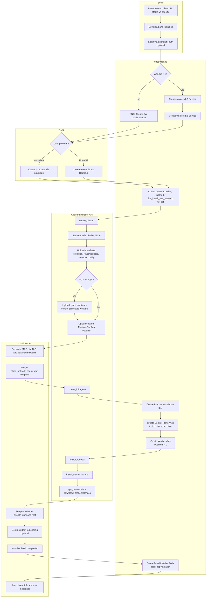

# host-ocp4-assisted-installer

- Provisions an OpenShift cluster using Assisted Installer and KubeVirt VMs running on an existing OpenShift/Kubernetes cluster.
- Handles SNO (Single Node, workers=0) and Full (control plane + workers) topologies.
- Creates KubeVirt VMs, Assisted Installer cluster + infra-env, injects manifests, configures DNS/Services, waits for readiness, starts install, and downloads credentials/artifacts.

## Flow

## Requirements
- Access to an OpenShift cluster API (`sandbox_openshift_api_url`) with KubeVirt and LoadBalancer services available.
- Assisted Installer credentials and pull secret.
- DNS either via `nsupdate` or AWS Route53 when configured.
- Collections used: `kubernetes.core`, `kubevirt.core`, `community.general`, `amazon.aws`, `rhpds.assisted_installer`.

## Variables
Required (must be provided by inventory/group vars):
- `ocp4_installer_version`: OpenShift version (e.g. `4.13` or `4.13.21`).
- `ocp4_ai_pull_secret` or `ai_pull_secret`: Pull secret JSON string/object.
- `ocp4_ai_offline_token` or `ai_offline_token`: Assisted Installer offline token.
- `sandbox_openshift_api_url`: API endpoint of the management cluster running KubeVirt.
- `sandbox_openshift_username`/`sandbox_openshift_password` or `sandbox_openshift_api_key`: For API auth.
- `cluster_name` and `cluster_dns_zone`: Base cluster FQDN components.

Common defaults you may override (see `defaults/main.yml`):
- `ai_cluster_version` (defaults to `ocp4_installer_version` or `4.13`)
- `ai_cluster_iso_type` (e.g. `minimal-iso`)
- `ai_ocp_namespace` (defaults to `env_type-guid`)
- `ai_ocp_vmname_master_prefix`, `ai_ocp_vmname_worker_prefix`
- `ai_storage_class`, `ai_local_storageclass`
- `ai_network_prefix`, `ai_service_network_cidr`, `ai_cluster_network_cidr`, `ai_network_mtu`
- `ai_control_plane_cores`, `ai_control_plane_memory`, `ai_workers_cores`, `ai_workers_memory`
- MAC/attached networks lists: `ai_masters_macs*`, `ai_workers_macs*`, `ai_attach_*_networks`, `ai_attach_*_macs`
- Extra disks: `ai_masters_extra_disks`, `ai_workers_extra_disks`
- Output and SSH: `ai_ocp_output_dir`, `ai_ssh_authorized_key`
- Optional: `ai_machineconfigs` (array of MachineConfig objects to upload)

Other inputs used by tasks (set by your inventory/parent role):
- `master_instance_count`, `worker_instance_count`
- `env_type`, `guid`, `ansible_user`, `student_name`, `install_student_user`
- DNS (optional): `cluster_dns_server`, `cluster_dns_port`, `cluster_dns_zone`, `ddns_key_name`, `ddns_key_secret`
- Route53 (optional): `route53_aws_zone_id`, `route53_aws_access_key_id`, `route53_aws_secret_access_key`
- Optional network override: `ai_install_use_network`

## Outputs
- Downloads to `{{ ai_ocp_output_dir }}/{{ cluster_name }}/`: kubeconfig(s), kubeadmin-password, ignition files, install-config and custom manifests.
- Writes user info messages with console/API URLs and client download link.
- Configures `/home/{{ ansible_user }}/.kube/config` and `/root/.kube/config`.

### Notes
- When `worker_instance_count == 0`, the role configures SNO and only creates the SNO Service and DNS.
- If `ai_machineconfigs` is provided, each item is uploaded as an Assisted Installer custom manifest.
