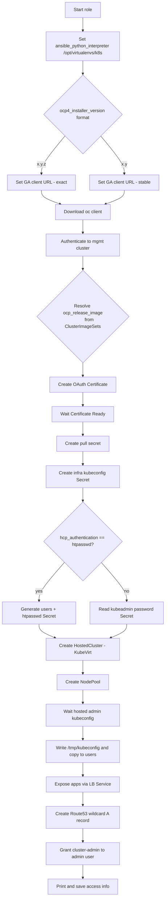
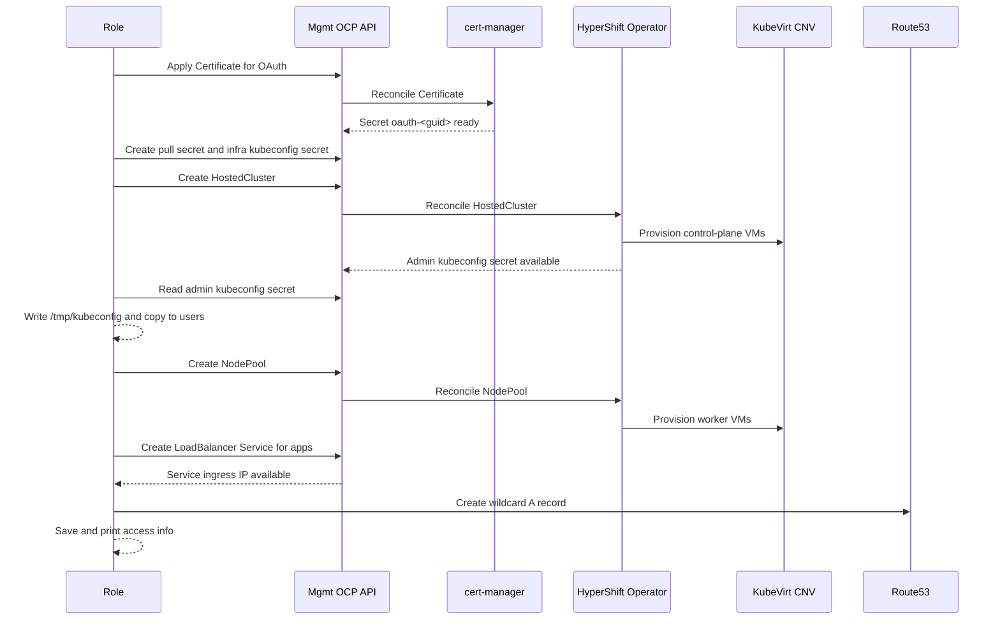

host-ocp4-hcp-cnv-install
=========================

Purpose
-------
Provision an OpenShift 4 Hosted Control Plane (HCP) cluster on OpenShift Virtualization (CNV/KubeVirt) using HyperShift APIs in a management cluster. The role:

- Creates TLS for OAuth via cert-manager `ClusterIssuer`
- Creates pull secret and infra kubeconfig secret for HyperShift
- Optionally configures `htpasswd` identity provider and generates users
- Creates `HostedCluster` and `NodePool` (KubeVirt platform)
- Waits for admin kubeconfig and makes it available locally
- Exposes apps via a LoadBalancer Service and creates a Route53 wildcard DNS record
- Copies kubeconfig to `/home/<ansible_user>/.kube/config` and `/root/.kube/config`
- Optionally sets up a student user kubeconfig
- Prints/saves access information via `agnosticd_user_info`

Requirements
------------
- Management OpenShift cluster with HyperShift installed (CRDs: `HostedCluster`, `NodePool`)
- OpenShift Virtualization (CNV/KubeVirt) enabled in the management cluster
- cert-manager installed with a `ClusterIssuer` matching `hcp_cluster_issuer`
- A DNS zone managed in Route53 if DNS automation is desired
- Access to the management cluster via username/password or API token
- Ansible collections in execution context: `kubernetes.core`, `community.okd`, `community.general`, `amazon.aws`
- Python virtualenv at `/opt/virtualenvs/k8s` with Kubernetes client libs (the role sets `ansible_python_interpreter` to this path)

Behavior Overview
-----------------
1. Downloads `oc` client matching the requested OCP version
2. Authenticates to the management cluster (username/password or API token)
3. Resolves `ocp_release_image` from ClusterImageSets for `hcp_cluster_version` (supports `x.y` or `x.y.z`)
4. Applies templates to create:
   - cert-manager `Certificate` for OAuth endpoint
   - pull secret for the release image
   - infra kubeconfig `Secret` used by HyperShift
   - optional `htpasswd` Secret and identity provider
   - `HostedCluster` and `NodePool` (KubeVirt)
5. Waits for hosted admin kubeconfig, writes `/tmp/kubeconfig`, copies to users
6. Creates a LoadBalancer Service targeting worker nodeports and adds a Route53 wildcard `A` record
7. Grants cluster-admin to the configured admin user and prints/saves access data

Diagram
-------


Sequence Diagram
----------------


Role Variables (defaults)
------------------------
Defined in `defaults/main.yaml`:

- `num_users` (int, default `1`): Number of non-admin users to create when `htpasswd` auth is enabled
- `hcp_ssh_authorized_key` (string): SSH public key for node access
- `hcp_cluster_name` (string, default `guid`): Cluster name
- `hcp_cluster_version` (string, default `4.16`): OCP version (`x.y` or `x.y.z`)
- `hcp_storage_class` (string, default `ocs-external-storagecluster-ceph-rbd`): Default storage class name
- `hcp_etcd_storage_class` (string, default `hcp_storage_class`): etcd storage class
- `hcp_ocp_namespace` (string): Namespace for hosted cluster resources (defaults to `<env_type>-<guid>`)
- `hcp_cluster_issuer` (string, default `letsencrypt-production-ec2`): cert-manager ClusterIssuer name
- `hcp_admin_password_length` (int, default `16`)
- `hcp_user_password_length` (int, default `16`)
- `hcp_user_base` (string, default `user`)
- `hcp_admin_user` (string, default `admin`)
- `hcp_user_passwords` (list, default `[]`): Populated when generating random passwords
- `hcp_admin_password` (string, default empty): If provided, used as admin password
- `hcp_user_password` (string, default empty): If provided, used for all non-admin users
- `hcp_enable_user_info_messages` (bool, default `true`): Print user info messages
- `hcp_enable_user_info_data` (bool, default `true`): Save user info data
- `hcp_controller_availability_policy` (string, default `SingleReplica`)
- `hcp_authentication` (string, default `htpasswd`): `htpasswd` or any other value to use kubeadmin secret
- `hcp_etcd_pvc_size` (string, default `8Gi`)
- `hcp_worker_cores` (int, default `16`)
- `hcp_worker_memory` (string, default `32Gi`)
- `hcp_worker_root_volume_size` (string, default `100Gi`)
- `hcp_worker_instance_count` (int): Number of worker replicas when autoscaling is disabled
- `hcp_worker_autoscale` (bool, default `false`)
- `hcp_worker_instance_min_count` (int, default `3`)
- `hcp_worker_instance_max_count` (int, default `5`)
- `hcp_quay_api_url` (string): Used to query release tags for tooling (informational)
- `hcp_disable_storage_class` (bool, default `false`): When true, sets storage driver to `None` in HostedCluster

Additional required/expected variables
--------------------------------------
- `guid` (string): Unique environment identifier
- `cluster_dns_zone` (string): Base DNS zone (e.g., `example.com`)
- `ocp4_pull_secret` (object or string): Pull secret JSON (object or already-serialized string)
- `worker_instance_count` (int) when not using autoscaling
- `sandbox_openshift_api_url` (string): Management cluster API URL
- One of:
  - `sandbox_openshift_username` and `sandbox_openshift_password` (strings)
  - or `sandbox_hcp.sandbox_openshift_api_key` (string)
- `sandbox_hcp.sandbox_openshift_api_url` (string): Management API URL used by HyperShift module defaults
- `sandbox_hcp.sandbox_openshift_namespace` (string): Namespace where hosted resources are created
- `sandbox_hcp.sandbox_openshift_apps_domain` (string): Apps domain of the management cluster (used for OAuth certificate and named certs)
- Route53 (optional, for DNS automation):
  - `route53_aws_access_key_id`, `route53_aws_secret_access_key`, `route53_aws_zone_id`

Optional variables
------------------
- `install_student_user` (bool): If true, copies kubeconfig to `/home/<student_name>/.kube/config`
- `student_name` (string): Target username for student kubeconfig copy
- `ansible_user` (string): Used to place kubeconfig in `/home/<ansible_user>/.kube/config`
- `ocp4_installer_version` (string): `x.y` or `x.y.z`; determines client URL and release image selection
- `ocp4_installer_root_url` (string): Override clients mirror root if needed

Outputs and Side Effects
------------------------
- Resources created in the management cluster namespace `{{ sandbox_hcp.sandbox_openshift_namespace }}`:
  - `Certificate` `oauth-{{ guid }}`
  - `Secret` `hcp-{{ guid }}-pull-secret`
  - `Secret` `hcp-{{ guid }}-infra-credentials`
  - `Secret` `htpasswd-{{ guid }}` (when `hcp_authentication == 'htpasswd'`)
  - `HostedCluster` `hcp-{{ guid }}`
  - `NodePool` `hcp-{{ guid }}`
- LoadBalancer `Service` `svc-{{ guid }}-apps` and Route53 wildcard `A` record `*.apps.hcp-{{ guid }}.{{ cluster_dns_zone }}`
- Local files: kubeconfig copied to `/home/{{ ansible_user }}/.kube/config` and `/root/.kube/config`
- User info printed and stored via `agnosticd_user_info`

Example
-------
Playbook snippet:

```yaml
- hosts: bastion
  gather_facts: false
  roles:
    - role: host-ocp4-hcp-cnv-install
      vars:
        guid: abc123
        cluster_dns_zone: example.com
        hcp_cluster_version: "4.16"
        sandbox_openshift_api_url: https://api.mgmt.example.com:6443
        sandbox_hcp:
          sandbox_openshift_api_url: https://api.mgmt.example.com:6443
          sandbox_openshift_api_key: "<token>"
          sandbox_openshift_namespace: hcp-abc123
        ocp4_pull_secret: "{{ lookup('file', 'pull-secret.json') | from_json }}"
        hcp_authentication: htpasswd
        num_users: 5
        route53_aws_access_key_id: "AKIA..."
        route53_aws_secret_access_key: "..."
        route53_aws_zone_id: "Z123456789"
```

Notes
-----
- `hcp_cluster_version` may be specified as `x.y.z` (exact) or `x.y` (latest matching `ClusterImageSet` will be selected). The role fails early if a suitable image set is not found.
- If `hcp_authentication != 'htpasswd'`, the role reads the kubeadmin password from `hcp-{{ guid }}-kubeadmin-password` Secret.
- DNS automation via Route53 is optional; skip Route53 variables to disable it.
- To remove a hosted cluster, delete the `HostedCluster` and `NodePool` objects (or use a corresponding destroy role if available).
