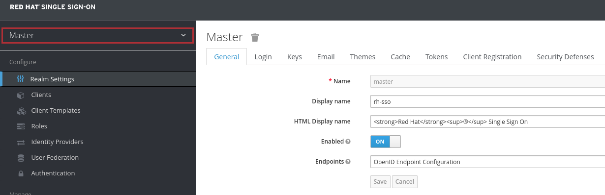
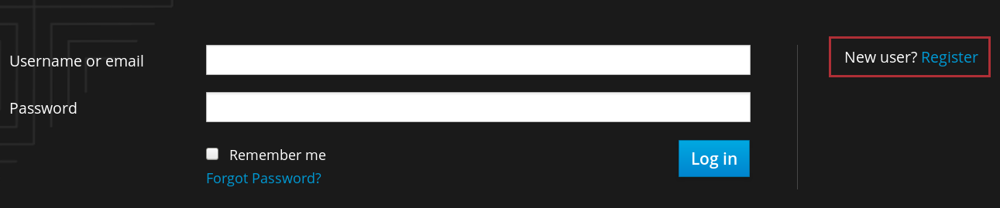
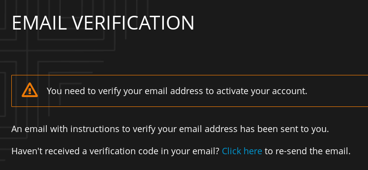
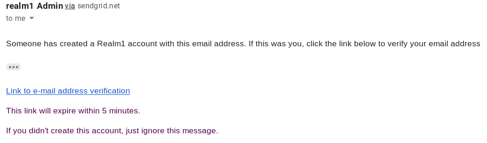
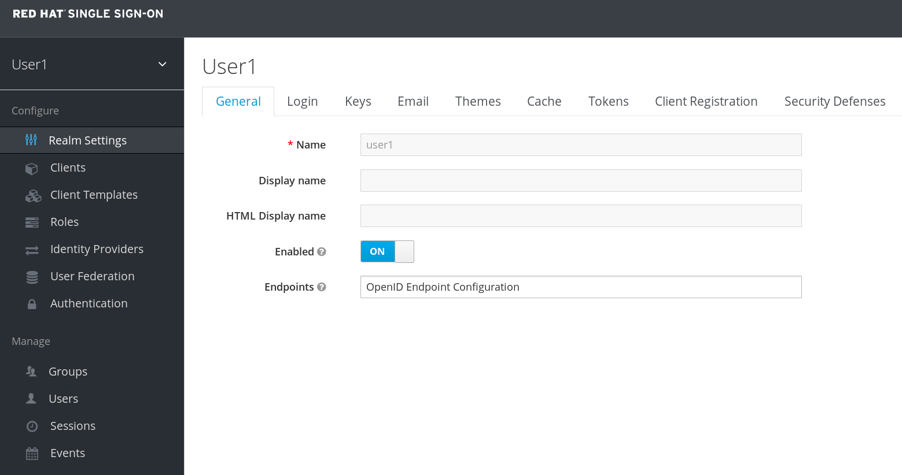
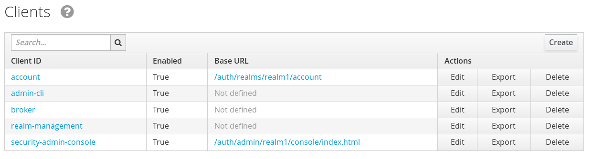

:scrollbar:
:data-uri:
:toc2:
:linkattrs:

= ocp-workload-mw-rh-sso

:numbered:

== Overview

This role is intended to provision a persistent Red Hat sso installation..

It also allows for management (ie:  creation and deletion)  of a configurable number of SSO _realms_ in a RHT SSO installation.

=== Reference

. link:https://www.keycloak.org/documentation.html[Latest keycloak documentation]
. link:https://access.redhat.com/documentation/en-us/red_hat_single_sign-on/7.2/html-single/red_hat_single_sign-on_for_openshift[RH-SSO for OCP]
. link:https://docs.openshift.com/container-platform/3.10/dev_guide/secrets.html#service-serving-certificate-secrets[OCP Service Serving Certificate Secrets]

== RH-SSO _Multi-Realm_ Deployment

=== Pre-reqs
. This ansible workload assumes the existence of a remote OCP 3.10 environment with a minimum of 5GB RAM.

. The commands provided in this section make use of an `oc` client running on your local machine.
Ensure that this `oc` client is on the $PATH of your local environment and its version aligns with that of your OCP environment.

. [blue]#The local oc client will need to already be authenticated to the remote OCP environment as a cluster-admin user.#

. Ensure that the link:https://stedolan.github.io/jq/[jq] utility is installed on your machine.

. Ensure that ansible is installed on your local machine.

. Ensure that this git project has been cloned to your local machine.
+
The `ansible-playbook` commands listed in this section are to be executed from the following path: `/path/to/ansible-agnostic-deployer/ansible` .

=== Environment variables

The following environment variables will need to be set in the shell of your local environment.
These environment variables will be used throughout the workload.

-----

# Update the following:
$ echo "export OCP_PROJECT_PREFIX=<your initials>" >> ~/.bashrc          # Used later in lab when creating an OCP project
$ echo "export pleaseHackMePasswd=<UPDATE ME !!! >" >> ~/.bashrc         # Used later in lab when creating a JDK Truststore
$ echo "export ocp_admin_username=sso0" >> ~/.bashrc
$ echo "export rhsso_project=rhsso-\$ocp_admin_username" >> ~/.bashrc

# Execute the following:
$ source ~/.bashrc

# Copy-n-paste the following:
WORKLOAD="ocp-workload-mw-rh-sso"
SUBDOMAIN_BASE=`oc whoami --show-server | cut -d'.' -f 2,3,4,5 | cut -d':' -f 1`
SSO_SITE_ADMIN_USERNAME=master
SSO_SITE_ADMIN_PASSWORD=master

-----

=== Provision RH-SSO

. At a terminal window, change directories to: `/path/to/ansible-agnostic-deployer/ansible`
. Execute:
+
-----
$ ansible-playbook -i localhost, -c local ./configs/ocp-workloads/ocp-workload.yml \
                    -e"ANSIBLE_REPO_PATH=`pwd`" \
                    -e"ocp_workload=${WORKLOAD}" \
                    -e"ocp_user_needs_quota=true" \
                    -e"ACTION=create" \
                    -e"SSO_SITE_ADMIN_USERNAME=$SSO_SITE_ADMIN_USERNAME" \
                    -e"SSO_SITE_ADMIN_PASSWORD=$SSO_SITE_ADMIN_PASSWORD" \
                    -e"admin_username=$ocp_admin_username" \
                    -e"subdomain_base=$SUBDOMAIN_BASE"

-----

. Once provisioning has completed, view the certificate associated with the new RH-SSO server:
+
-----
$ echo '' | openssl s_client -connect `oc get route sso -n $rhsso_project --template "{{.spec.host}}"`:443 | more
-----

. Set an environment variable that references the URL of the newly provisioned RH-SSO:
+
-----
echo "export rhsso_url=https://`oc get route sso -n rhsso-$ocp_admin_username --template "{{.spec.host}}" -n rhsso-$ocp_admin_username`" >> ~/.bashrc

source ~/.bashrc
-----

[[realm_mgmt]]
=== Realm management

This section list ansible commands to create and delete a configurable number of SSO realms in a previously provisioned RH-SSO installation.

Each of these SSO realms are enabled to allow one or more users to register as a user of this realm.
The default behavior of registered realm users is that they are full administrators of the realm.
Obviously this behavior is appropriate for demo and learning scenarios only.

Each of these realms is also pre-configured with appropriate smtp related settings necessary to deliver emails.

-----

#### UPDATE ME !!!!
START_REALM=1
END_REALM=1
smtp_host=
smtp_userid=
smtp_passwd=

####     Create Realms
$ ansible-playbook -i localhost, -c local ./configs/ocp-workloads/ocp-workload.yml \
                    -e"ANSIBLE_REPO_PATH=`pwd`" \
                    -e"ocp_workload=${WORKLOAD}" \
                    -e"ACTION=realm_mgmt" \
                    -e"start_realm=$START_REALM" \
                    -e"end_realm=$END_REALM" \
                    -e"subdomain_base=$SUBDOMAIN_BASE" \
                    -e"smtp_host=$smtp_host" \
                    -e"smtp_passwd=$smtp_passwd" \
                    -e"smtp_userid=$smtp_userid" \
                    -e"SSO_SITE_ADMIN_USERNAME=$SSO_SITE_ADMIN_USERNAME" \
                    -e"SSO_SITE_ADMIN_PASSWORD=$SSO_SITE_ADMIN_PASSWORD" \
                    -e"admin_username=$ocp_admin_username" \
                    -e"create_realms=true"

####    Delete Realms
$ ansible-playbook -i localhost, -c local ./configs/ocp-workloads/ocp-workload.yml \
                    -e"ANSIBLE_REPO_PATH=`pwd`" \
                    -e"ocp_workload=${WORKLOAD}" \
                    -e"ACTION=realm_mgmt" \
                    -e"start_realm=$START_REALM" \
                    -e"end_realm=$END_REALM" \
                    -e"subdomain_base=$SUBDOMAIN_BASE" \
                    -e"SSO_SITE_ADMIN_USERNAME=$SSO_SITE_ADMIN_USERNAME" \
                    -e"SSO_SITE_ADMIN_PASSWORD=$SSO_SITE_ADMIN_PASSWORD" \
                    -e"admin_username=$ocp_admin_username" \
                    -e"create_realms=false"

-----

=== Delete RH-SSO

-----
$ ansible-playbook -i localhost, -c local ./configs/ocp-workloads/ocp-workload.yml \
                    -e"ANSIBLE_REPO_PATH=`pwd`" \
                    -e"ocp_workload=${WORKLOAD}" \
                    -e"ACTION=remove" \
                    -e"subdomain_base=$SUBDOMAIN_BASE"
-----

== RH-SSO Site Admin Utilization

=== RH-SSO Admin Console
. Open a web browser and navigate to the console of the `master` realm :
+
-----
$ echo -en "\n$rhsso_url/auth/admin/master/console\n\n"
-----

. Authenticate using the values of the $SSO_SITE_ADMIN_USERNAME and $SSO_SITE_ADMIN_PASSWORD environment variables used when the RH-SSO instance was provisioned.

. As the RH-SSO site admin, you have full access to all of its resources.
+

=== Set RH-SSO Log to `DEBUG` (Optional)

At times, you may want to increase the log level of the `org.keycloak` java package of your RH-SSO server from `INFO` to `DEBUG`.
Doing so is beneficial when attempting to troubleshoot problems with security protocols and RH-SSO.

. Open a remote shell session to your RH-SSO pod:
+
-----
$ oc rsh -n $rhsso-project \
            $(oc get pod -n $rhsso-project | egrep "sso-[1-9]" | awk '{print $1}')
-----

. Edit the master configuration file for your RH-SSO server:
.. Open the configuration file in an editor:
+
-----
$ vi /opt/eap/standalone/configuration/standalone-openshift.xml
-----

.. Search for the `org.jboss.as.config` field:
+
-----
            <logger category="org.jboss.as.config">
                <level name="DEBUG"/>
            </logger>
-----

.. Just below this XML block, add a similar block as follows:
+
-----
            <logger category="org.keycloak">
                <level name="DEBUG"/>
            </logger>
-----
.. Save the change and exit.

. Restart the keycloak JVM within the same RH-SSO pod:
.. Change to the following directory:
+
-----
cd /opt/eap/bin/
-----

.. Execute this command:
+
-----
./jboss-cli.sh --connect ':reload'
-----

== Realm User Registration
This section of the lab assumes you have already provisioned one or more SSO realms as per the <<realm_mgmt>> section of this lab.

The purpose of this section is to provide students with instructions that detail how to register as a user of a previously provisioned SSO realm.
This entire section can be copy-n-pasted into the lab instructions of a course that leverages this multi-realm RH-SSO.

=== Registration

. Set an environment variable that corresponds to a specific realm that you want to utilize:
+
-----
$ echo "export rhsso_realm=<realm name>" >> ~/.bashrc

$ source ~/.bashrc
-----

. Open a web browser and navigate to the console of your target realm :
+
-----
$ echo -en "\n$rhsso_url/auth/admin/$rhsso_realm/console\n\n"
-----

. Click the `Register` link:
+

. Fill in all fields of the registration form.  Ensure you are using a valid email.
. Click `Register`.
. Expect your browser to be redirected to a page indicating the need to verify your email and account:
+

. Check your email for a verification request similar to the following:
+

. In the email, click the link to `email address verification`.
. Your browser should now be re-directed to the homepage of your target SSO realm
+

+
NOTE: This newly registered realm user has administrative access to all settings of a realm.

. In a terminal window of your local machine, set environment variables specific to this new realm user:
+
-----
$ realmUserId=<change me>
$ realmPasswd=<change me>
-----

. In your browser, navigate to the `Clients` of your realm.
+
Notice the presence of 5 default SSO clients.  Each of them is configured to allow for different OAuth2 and OIDC protocols.
+

== Realm Endpoints

=== Overview

Your Red Hat SSO server implements an endpoint called `well-known` that lists other endpoints and configuration options relevant to the OAuth2/OpenID Connect implementation of Red Hat Single Sign-On.

The purpose of this section is to expose a user (ie: a student) to some of the `well-known` endpoints of the OIDC specification.
These `well-known` endpoints are specific to the user's SSO realm.

Red Hat SSO also exposes realm administration endpoints.
A few of these realm admin endpoints are also introduced in this section.

This entire section can be copy-n-pasted intoecho -en "\n$rhsso_url/auth/admin/master/console\n\n" the lab instructions of your course.

The following utilities will need to be installed on your local machine:

. `openssl`
. `keytool` : (from the Java Development Kit)

=== OIDC well-known Endpoints

. Execute the following and study the response:
+
-----
$ curl -X GET "$rhsso_url/auth/realms/$rhsso_realm/.well-known/openid-configuration" | python -m json.tool
-----

* The various OpenID Connect `Relying Party` clients invoke these Red Hat SSO endpoints throughout the remainder of this lab.
* Two endpoints are of particular interest:
** link:http://openid.net/specs/openid-connect-core-1_0.html#AuthorizationEndpoint[Authorization Endpoint]
** link:http://openid.net/specs/openid-connect-core-1_0.html#TokenEndpoint[Token Endpoint]

. View the list of `grant_types_supported` types:
+
-----
$ curl -X GET "$rhsso_url/auth/realms/$rhsso_realm/.well-known/openid-configuration" | jq -r '.grant_types_supported'
-----
+
.Sample Output
-----
[
  "authorization_code",
  "implicit",
  "refresh_token",
  "password",
  "client_credentials"
]
-----
* This list of `grant_type_supported` types corresponds to the various OAuth2/OpenID Connect flows that are supported by the Red Hat SSO server.

=== Smoke Test OAuth2 Access Token

. Ensure the values of the $rhsso_realm, $realmUserId and $realmPasswd environment variables are set in your shell.

. Retrieve OIDC Access Token from a realm:
+
-----
$ retrieve_token_url="$rhsso_url/auth/realms/$rhsso_realm/protocol/openid-connect/token"

$ TKN=$(curl -X POST "$retrieve_token_url" \
            -H "Content-Type: application/x-www-form-urlencoded" \
            -d "username=$realmUserId" \
            -d "password=$realmPasswd" \
            -d "grant_type=password" \
            -d "client_id=admin-cli" \
            | sed 's/.*access_token":"//g' | sed 's/".*//g')
-----
+
NOTE: By default, every RH-SSO realm includes a SSO client called: _admin-cli_.
And by default, this _admin-cli_ client is enabled with the _Resource Owner Password Credentials_ OAuth2 flow.
This OAuth2 flow makes possible the above invocation for an access token given the realm user's userId and passwd.

=== Realm Key and Certificate
. Retrieve public key and certificate specific to realm:
.. When a realm is created a key pair and a self-signed certificate is automatically generated.
+
Keycloak currently only supports RSA signatures so there is only one active keypair.
.. Set the value of $retrieve_key_url environemnt variable:
+
-----
$ retrieve_key_url="$rhsso_url/auth/admin/realms/$rhsso_realm/keys"
-----

.. Retrieve value of RSA key:
+
-----
$ RSA_PUB_KEY=$(curl -k -X GET "$retrieve_key_url" \
           -H "Authorization: Bearer $TKN" \
           | jq -r '.keys[]  | select(.type=="RSA") | .publicKey'
    )

$ echo $RSA_PUB_KEY
MIIBIjANBgkqhkiG9w0BAQEFAAOCAQ8AMIIBCgKCAQEAktETcy8xI/rxit6DH9LW1kAB/0XKiV5eujQL9rL+9WD9ZruC2hMFKhme+kyNjNVCf2cqiY0IChmSqTrfm7OcL3k+Rfq91zDgMI19pszoMGyG2Ek2UZYWNBhydBIPBr70njec7Vq8a/bn88evEROetlUHWWcSuwqsiooHD3RNzuDgRB+2ztim8KttusbZxGPGjIjCNlFEBVetfxpHbTBCeN8dAdOiYRjmW6QVxEUH9m0Hcvcw8XwEyVRvd1HpkzMK0BVBnN73d/G743pvyc2huv/Cj+zoBipxNwKJ8rnPGupBVK/17WmyFgi+CDhZww8EwRiSSwrow+Qv1hUP9bnoFwIDAQAB
-----

.. Retrieve value of Realm RSA certificate:
+
-----
$ RSA_CERT=$(curl -k -X GET "$retrieve_key_url" \
           -H "Authorization: Bearer $TKN" \
           | jq -r '.keys[]  | select(.type=="RSA") | .certificate'
    )

$ echo $RSA_CERT
MIICuTCCAaECBgFcJ85oAjANBgkqhkiG9w0BAQsFADAgMR4wHAYDVQQDDBVyaHRfZ3B0ZV8zc2NhbGVfcmVhbG0wHhcNMTcwNTIwMjEzOTE3WhcNMjcwNTIwMjE0MDU3WjAgMR4wHAYDVQQDDBVyaHRfZ3B0ZV8zc2NhbGVfcmVhbG0wggEiMA0GCSqGSIb3DQEBAQUAA4IBDwAwggEKAoIBAQCS0RNzLzEj+vGK3oMf0tbWQAH/RcqJXl66NAv2sv71YP1mu4LaEwUqGZ76TI2M1UJ/ZyqJjQgKGZKoGt+bs5wveT5F+r3XMOAwjX2mzOgwbIbYSTZRlhY0GHJ0Eg8GvvSeN5ztWrxr9ufzx68RE562VQdZZxK7CqyKigcPdE3O4OBEH7bO2Kbwq226xtnEY8aMiMI2UUQFV61/GkdtMEJ43x0B06JhGOZbpBXERQf2bQdy9zDxfATJVG93UemTMwrQFUGc3vd38bvjem/JzaG6/8KP7OgGKnE3Aonyuc8a6kFUr/XtabIWCL4IOFnDDwTBGJJLCujD5C/WFQ/1uegXAgMBAAEwDQYJKoZIhvcNAQELBQADggEBABM81ImbVgN5VoD7b7RCH0jYW9pUzIwjUUWU3P1E+RGMwyyhgCwMK/wDpzty5jno7XyE1oePgZg8OmXY2FGlWi0JzCF8WGsHVEZWiKPkSs9miz5+x5VqKUEM4nrmF3OgEFPH/gJPhx8/GNutSpf0AIHcVDeWL7nayyjMZWSdXm82crd5gZXDSmNgjjeqhTCPFCrMv3nQq9wsL3jDEc7pOAkblsu83GCyD0WmdHqAY/EdT/Jz1b2lJw/Oda6b9Hg93MvnnaJMam7Q7q4K0oRFaYD0ZtYm926YQg5f1iLzoocuouuOeHrMfZQOqb96iaGYeQF+GghpfNXwKMLOhQh3tJM=
-----

. Create a PEM file from certificate:
.. Set an environment variable the defines path to target x.509 certificate in PEM format:
+
-----
$ realm_cert=/tmp/$rhsso_realm.pem
-----
.. Create x.509 certificate in PEM format:
+
-----
$ echo "-----BEGIN CERTIFICATE-----" > $realm_cert; echo $RSA_CERT >> $realm_cert; echo "-----END CERTIFICATE-----" >> $realm_cert
-----

.. View details of SSO Realm certificate:
+
-----
$ openssl x509 -in $realm_cert -text -noout
-----

== Smoke Test OAuth2 Auth and RBAC

=== Business Service
In this section, you will define a DeploymentConfig for a simple backend business service that is to be secured via the OIDC protocol.

. Create a new project for your mock RESTful business service applications:
+
-----
$ oc new-project $OCP_PROJECT_PREFIX-bservices \
     --display-name="$OCP_PROJECT_PREFIX-bservices" \
     --description="Business Services to be secured using OIDC"
-----

. If not already there, switch to this new project:
+
-----
$ oc project $OCP_PROJECT_PREFIX-bservices
-----

. Create a new application based on a simple RESTful service implemented using Wildfly Swarm:
+
-----
$ oc create -f  https://raw.githubusercontent.com/gpe-mw-training/3scale_onpremise_implementation_labs/secure/services/wfswarm-date-service/wf-swarm-oauth.yaml

$ oc new-app \
     --template=wf-swarm-oauth \
     --param=TRUSTSTORE_PASSWORD=$pleaseHackMePasswd \
     --param=TRUSTSTORE_PATH=/app/certs/"$rhsso_realm"_truststore.jks \
     --param=KEYCLOAK_ADAPTER_PATH=/app/rhsso-config/keycloak.json
-----
+
This command creates a deployment config with a paused pod.
The pod includes a Java based container.
The `--XmX` of the JVM in the container is set to 80% of 1Gi; so about 800 MB

=== Java Truststore

In this section, you add a SSO realm certificate to a Java truststore:

. Create Java truststore populated with the realm certificate created in a previous section of the lab:
+
-----
$ keytool -import \
          -file /tmp/$rhsso_realm.pem \
          -alias $rhsso_realm.ca \
          -keystore /tmp/"$rhsso_realm"_truststore.jks \
          -storepass $pleaseHackMePasswd
-----
+
Recall that the SSO realm certificate is in the file (/tmp/$rhsso_realm.pem) being imported into the Java truststore.

. Confirm contents of the Java truststore:
+
-----
$ keytool -v \
          -list \
          -keystore /tmp/"$rhsso_realm"_truststore.jks \
          -storepass $pleaseHackMePasswd
-----

. Create a secret from the  previously created truststore:
+
----
$ oc create secret generic sso-truststore-secret \
            --from-file=/tmp/"$rhsso_realm"_truststore.jks
----

. Mount the secret as a volume in the Swarm deployment config:
+
-----
$ oc set volume dc/wf-swarm-oauth --add --overwrite \
     --name=trustore-volume \
     -m /app/certs \
     --type=secret \
     --secret-name=sso-truststore-secret
-----
+
Notice that the mount point on the DC where the truststore will reside matches that of the template parameter: `TRUSTSTORE_PATH`.

=== `keycloak.json` adapter

. Define keycloak adapter specific to the existing `bearer-only` client called: `realm-management` :
+
-----
$ echo "
{
  \"realm\": \"$rhsso_realm\",
  \"bearer-only\": \"true\",
  \"auth-server-url\": \"$rhsso_url/auth\",
  \"ssl-required\": \"external\",
  \"realm-public-key\": \"$RSA_PUB_KEY\",
  \"resource\": \"realm-management\",
  \"use-resource-role-mappings\": \"true\"
}" > /tmp/keycloak.json
-----

. Create a ConfigMap from the `keycloak.json` file.
+
You then mount it as a volume and point WildFly Swarm to the mounted `keycloak.json`.

.. Create a ConfigMap called `date-service-rhsso` in the `bservices` project on OpenShift from the `keycloak.json` file:
+
----
$ oc create configmap keycloak-resource-cm --from-file=/tmp/keycloak.json
----

.. Mount the configmap as a volume in the Swarm DC:
+
-----
$ oc set volume dc/wf-swarm-oauth --add --overwrite \
     --name=keycloak-resource-volume \
     -m /app/rhsso-config \
     --type=configmap \
     --configmap-name=keycloak-resource-cm
-----

. Resume the paused deploymentconfig:
+
-----
$ oc rollout resume dc/wf-swarm-oauth
-----

. Test OIDC secured business service:
+
-----
$ TKN=$(curl -k -X POST "$retrieve_token_url" \
            -H "Content-Type: application/x-www-form-urlencoded" \
            -d "username=$realmUserId" \
            -d "password=$realmPasswd" \
            -d "grant_type=password" \
            -d "client_id=admin-cli" \
            | sed 's/.*access_token":"//g' | sed 's/".*//g')

$ curl -k -v -X GET \
       -H "Authorization: Bearer $TKN" \
       https://`oc get route/wf-swarm-oauth --template "{{.spec.host}}"`/time/now
-----
