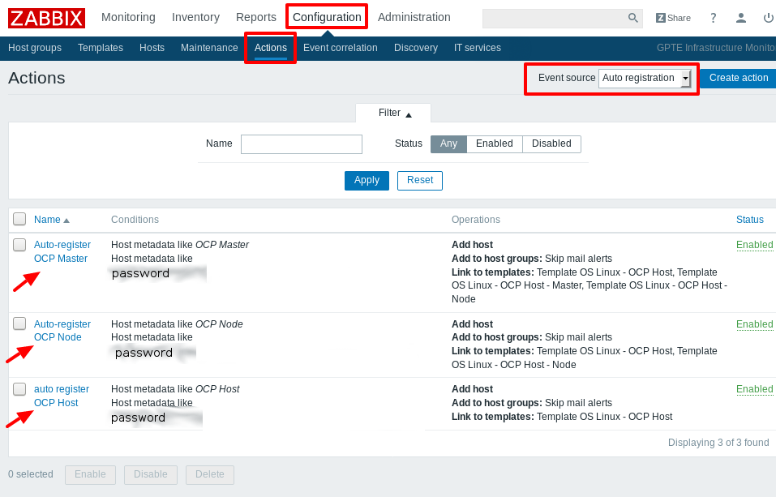

= zabbix-client role

In this role:

- Install zabbix agent
- Configure network (open port 10050)
- setup selinux for zabbix agent to work
- set `Server` and `ServerActive` for zabbix agent
- auto-register host to zabbix server

// == Requirements
// 
// Any pre-requisites that may not be covered by Ansible itself or the role should be mentioned here. For instance, if the role uses the EC2 module, it may be a good idea to mention in this section that the boto package is required.

== Role Variables

- `zabbix_host`: the zabbix server
- `zabbix_auto_registration_keyword`: A string that you will add into Zabbix configuration to help you categorize auto-registered hosts  (default: 'OCP Host')
- `zabbix_auto_registration_pass`: A string to allow auto-registration, setup in Zabbix *Actions*
- `zabbix_hostname`: Hostname that will appear in Zabbix

== Auto-registration

To enable auto-registration, you will need to set the following variables:

- `zabbix_hostname`
- `zabbix_auto_registration_keyword`
- `zabbix_auto_registration_pass`

=== In Zabbix

You will create *Actions* to auto-register hosts:

For more information, see https://www.zabbix.com/documentation/3.2/manual/discovery/auto_registration[Zabbix documentation].

== Example Playbook

.post-software.yml
----
- name: Zabbix for nodes
  hosts:
    - nodes
    - infranodes
  gather_facts: true
  become: yes
  vars:
    zabbix_auto_registration_keyword: OCP Node
    #pass variable should be setup in env_secret_vars.yml:
    #zabbix_auto_registration_pass: PASS_SETUP_IN_ZABBIX_ACTIONS
    zabbix_hostname: "OCP {{ repo_version }} {{ guid }} - {{ ansible_hostname }}"
  roles:
    - { role: "zabbix-client" }
  tags:
    - env-specific
    - install_zabbix
----

License
-------

BSD

// Author Information
// ------------------
// 
// An optional section for the role authors to include contact information, or a website (HTML is not allowed).
