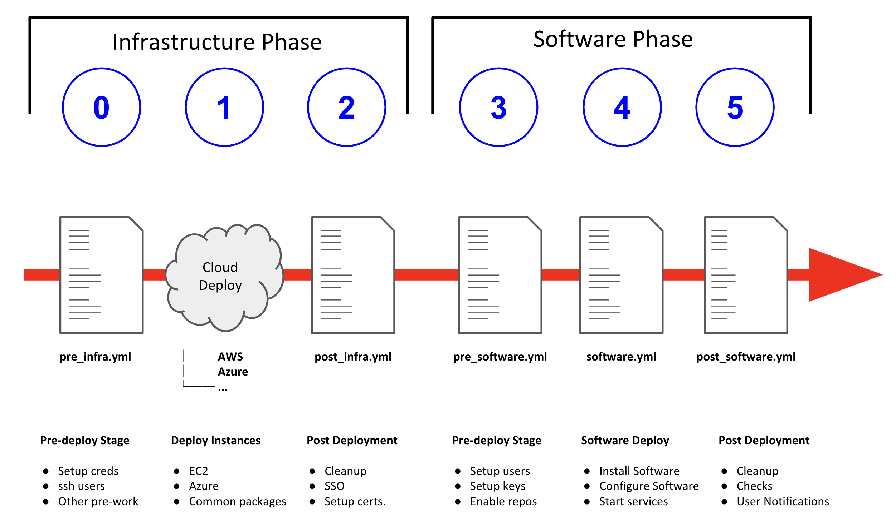

:toc2:
image::https://travis-ci.org/sborenst/ansible_agnostic_deployer.svg?branch=development[link="https://travis-ci.org/sborenst/ansible_agnostic_deployer"]

= Introduction: Writing Configs

This document gives an overview of the process of writing either a new _config_ 
 from scratch or copying and modifying an existing _config_.
Well designed _configs_, can easily and *cleanly* be abstracted to allow 
 deployment to multiple different Public and Private Clouds including AWS, 
  Azure.

=== What are _configs_?

A _config_ is simply a lab, workshop, or other deployment that has been defined 
 and encapsulated in a series of playbooks, variable files, and templates in a
  _config_ directory.
This allows _Ansible Agnostic Deployer_ to deploy it simply and repeatedly on
 one or more Cloud Platforms.

=== How you Deploy _configs_

_configs_ are typically deployed via one of 3 methods:

. From the command line. A suitably configured Ansible Control Node, or
 laptop, can invoke a new _config_ deployment by invoking 
  `ansible-playbook main.yml -e @./configs/<CONFIG_NAME?sample_vars.yml` or other
    variable file with the appropriate parameters. See
     link:../ansible/configs/three-tier-app/README.adoc[Three Tier App]  for an
      example.

. Via a front-end application such as Red Hat Cloud Forms or ServiceNow which
 provides a user friendly catalog or "portal" type interface to the end user and
  can invoke the appropriate ansible command directly or via a "wrapper" script.

It is also possible to invoke a _config_ by creating *AgnosticD* as an Ansible
 Tower Project and defining _configs_ as jobs. Going forward this pattern will
  influence the future evolution of *AgnosticD*.  Once a _config_ is defined as
   a job it can either be directly invoked or via a front-end application or 
    script making an API call to an Ansible Tower server.

=== How *AgnosticD* Deploys _configs_

*AgnosticD* deploys _configs_ via a 6 stage process, discussed in more detail
 below.
This provides _config_ creators considerable flexibility, without undue 
 complexity, to control the deployment process in a modular maneer and enables
  you to abstract the Cloud Specfic steps (e.g. *AWS ec2* or *Microsoft Azure*)
   from the application or OS specfic steps. Greatly enhancing Cloud Portability.

The last point is key, as it allows developers to simply add new Cloud Platforms
 at a latter date, or provide their _configs_ with multi-cloud support from day 1.
The term *Cloud Provider* includes the ability to add a virtualization platform 
 (e.g. KVM, Hyper-V), Public Cloud Pletform (e.g. Google Cloud Engine), or a 
  container based platfrom such as OpenShift or Docker.

Currently supported platforms (via Cloud Providers):
* AWS EC2
* Azure

==== Deployment Phases 

When ansible starts to deploy a _config_ the process involves 2 logically 
 destinct phases each broken up into 3 Steps. This is illustrated below:

== Basic _config_ Deployment Flow

<<<< CURRENT EDITING POINT >>>>

The repository contains various Ansible playbooks, templates, and other support
files used to provision different software (OpenShift, Ansible Tower, ...) onto 
Cloud Infrastructure (AWS, Ravello, ...). The key files and directories include:

* `./docs/` Start here
* `./ansible` The execution environment
* `./ansible/main.yml` The entry point for a deployment
* `./ansible/configs` Home to the _configs_ to deploy

The Contributors Guides explore the relevant structures in significantly more detail:

* link:docs/Creating_a_config.adoc[Creating a Config]
* link:docs/Creating_a_cloud_deployer.adoc[Creating a Cloud Deployer]

== Overview of Ansible Agnostic Deployer Flow

image::docs/images/agnosticd_flow.png[width=100%]

AAD deployments start by invoking a common `main.yml` with environmental
variables identifying the _config_ and the cloud platform to deploy plus other meta-data.

e.g. `ansible-playbook main.yml -e "env_type=three-tier-app cloud_provider=aws"`

.*Simplified execution flow of `main.yml`
[source,bash]
----
- import_playbook: "configs/{{ env_type }}/pre_infra.yml"
- import_playbook: "cloud_providers/{{ cloud_provider }}_infrastructure_deployment.yml"
- import_playbook: "configs/{{ env_type }}/post_infra.yml"
- import_playbook: "configs/{{ env_type }}/pre_software.yml"
- import_playbook: "configs/{{ env_type }}/software.yml"
- import_playbook: "configs/{{ env_type }}/post_software.yml"
----

For _config_ developers the above stages provide 5 _hooks_ for customizing the configuration of your environment and 1 _hook_ for customizing it for one or more cloud providers (e.g. AWS, Azure, etc).

An _Example config_ is provided by `ansible/configs/just-some-nodes-example`

==== Stage 0 `pre_infra.yml`

In this stage *AAD* is the entry playbook and is typical used for setting up any
infrastucture etc prior to launching a cloud deployemnt. Typical tasks would include:

* Creating necessary ssh keys
* Moving any ssh keys into place, setting permissions etc
* Creating any payloads to be used in later stages e.g. repo files etc
* Ensuring cloud credentials are avaialble 

==== Stage 1 Cloud Provider Deploy

This stage is unique in the flow in that the _config_ creator doesn't supply a 
playbook but typically has to provide cloud specfic configuration data.

Clouds are selected via the value of the `cloud_provider` variable and supported
clouds can be found in `ansible/cloud_providers`. Currently supported are:

* Amazon Web Services (AWS)
* Microsfoft Azure

Example: *AWS* configs use CloudFormations templates to deploy their infrastructure 
so this can be provied 

[NOTE]
====
A Cloud Creators document exists to faciliate adding further clouds to *AAD*. Wish
list items include:

* OpenShift
* OpenStack
* Google Cloud Engine (GCE)
====

==== Stage 2 `post_infra.yml`

In this stage *AAD*

==== Stage 3 `pre_software.yml`

At this point the infrastucure should be up and running but typically in a totally
unconfugured state. 

Typical tasks:

* Setup yum repos or equivilent
* `ssh` key housekeeping - for example inserting additional keys and configuration
* Prepare `bastion` hosts or `jumpboxes`

==== Stage 4 `software.yml`

In this stage *AAD*

==== Stage 5 `post_software.yml`

== Overview of a _Config_

Documnetation: `docs/Creating_congfigs
_Configs_ are located in the `ansible/configs/` directory

[source,bash]
----
README.adoc              linklight                 ocp-ha-disconnected-lab   quay-enterprise
ans-tower-lab            linklight-demo            ocp-ha-lab                rhte-ansible-net
ansible-cicd-lab         linklight-engine          ocp-implementation-lab    rhte-lb
ansible-provisioner      linklight-foundations     ocp-multi-cloud-example   rhte-oc-cluster-vms
archive                  linklight-networking      ocp-storage-cns           rhte-ocp-workshop
bu-workshop              linklight-networking-all  ocp-workloads             simple-multi-cloud
just-some-nodes-example  ocp-clientvm              ocp-workshop              three-tier-app
lightbulb                ocp-gpu-single-node       openshift-demos
----
_Above configs subject to change over time_

A typical _Config_ is 

[source,bash]
----
three-tier-app
├── README.adoc             
├── destroy_env.yml
├── env_vars.yml
├── files
├── post_infra.yml
├── post_software.yml
├── pre_infra.yml
├── pre_software.yml
└── software.yml
----

