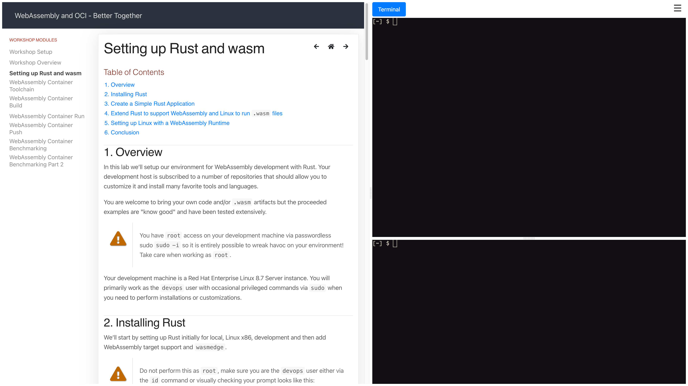

:toc2:

== Working with Bookbag

This document gives an overview of working with the `bookbag` workshop console.

=== What is _"bookbag"_

Bookbag is the name given to web-based UI that allows users to interact with demos, workshops, and labs by their browser. In a typical, customizable, configuration, it provides a number of frames with content such as:

* HTML demos with navigation
* Terminal(s)
* Consoles

In the example below we see a pretty typical example of a Bookbag UI with the workshop on the left and 2 resizable Terminal sessions on the right.

==== General Bookbag Resources

* link:https://github.com/redhat-gpte-labs/bookbag-template[Template Repo] 
** (Bookbag is implemented via a Container Image typically running on OpenShift, K8S, or a Container Engine)
* link:https://github.com/redhat-cop/agnosticd/tree/development/ansible/roles/bookbag[Agnosticd's *primary* bookbag role]

WARNING: There are other "bookbag" roles within AgnosticD, do not use unless you fully understand your use case.

== Implementing and Using Bookbag in your Configs and Catalog Items

This section will assume some familiarity with setting up catalog items via Agnostic V. However, much of this is equally pertinent to running book bag locally from your laptop via a var file.

=== Configuring `bookbag` to run with an OpenShift (OCP) CI

These configuration guidelines below apply equally to a standalone or dedicated OpenShift catalog item or a shared item. There is no configuration difference between these two different scenarios. This section also assumes some familiarity with the OpenShift workload pattern and AgnosticV.

NOTE: Non AgnosticV users can just add these to their var file and pass via `-e @my_vars.yaml`

.A typical AgnosticV `common.yaml` with Bookbag configured
[source,yaml]
----
infra_workloads:
  - ocp4_workload_le_certificates
  - ocp4_workload_lpe_automation_controller 
  - bookbag <1>

bookbag_git_repo: https://github.com/tonykay/wasm-oci-workshop.git <2>
bookbag_git_version: development # commit | tag | branch <3>
----

. Bookbag is the *final* role, or workload, listed in our `infra_workloads` list
+
IMPORTANT: bookbag consumes user_data so it must be called **after** all other workloads have run, to have visibility of that data.
. **Mandatory**, set the `bookbag_git_repo` var to point at your bookbag repo
. **Optional**, the `bookbag_git_version` repo allows users to specify a branch, tag, or commit
 
NOTE: The `bookbag_git_version` variable allows developers to both make changes and guarantee stability. For example, if using a typical AgnosticV entry a developer could take this approach:

.`dev.yaml`
[source,yaml]
----
infra_workloads:
  - ocp4_workload_le_certificates
  - ocp4_workload_lpe_automation_controller 
  - bookbag

bookbag_git_repo: https://github.com/tonykay/wasm-oci-workshop.git
bookbag_git_version: development  # head of development branch
----

.`event.yaml`
[source,yaml]
----
infra_workloads:
  - ocp4_workload_le_certificates
  - ocp4_workload_lpe_automation_controller 
  - bookbag

bookbag_git_repo: https://github.com/tonykay/wasm-oci-workshop.git
bookbag_git_version: workshop-wasm-0.3.0 # Stable git tag
----

NOTE: The above examples have some, unnecessary redundancy as typically both the role `bookbag` and the var `bookbag_git_repo` would live in `common.yaml`

