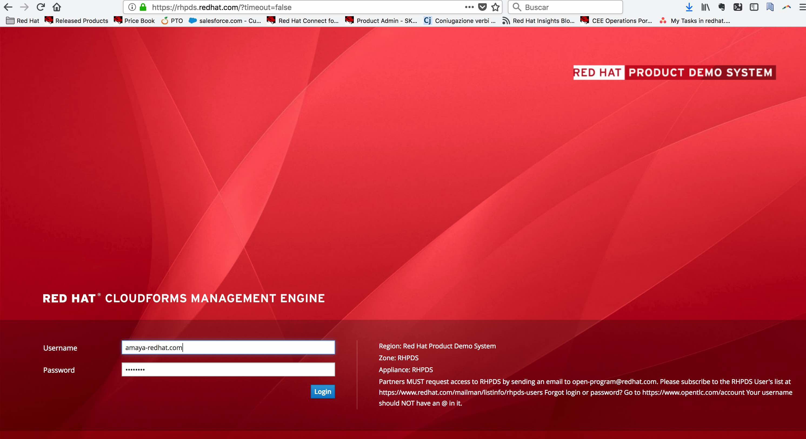
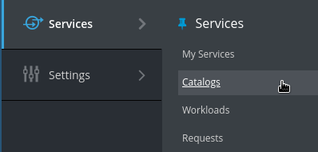
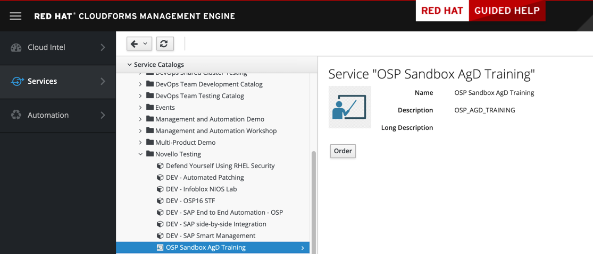

= How to order your OSP Sandbox to work with AgnosticD deployments

In this document is aimed to be a reference on how to setup your working machine (primarily an OSP Sandbox) for Ansible Agnostic Deployer development with OpenStack and AWS.

Whilst this document primarily at Red Hatters, and partners, who can self provision an OpenStack (OSP) Sandbox via Red Hat’s link:https://rhpds.redhat.com[RHPDS] it may also be useful to others working both with OpenStack and Ansible Agnostic Deployer aka AgnosticD.

For the purpose of this exercise we’ll use the AgnosticD config link:https://github.com/redhat-cop/agnosticd/tree/development/ansible/configs/a-base-config[a-base-config] which is simple to deploy, and extensible for anyone looking to deploy some instances on OpenStack.

I’ll assume you have either self provisioned, or been provided with, an OpenStack Sandbox instance and have the necessary ssh login details etc. 

In this document, I will use an OSP Sandbox instance as working machine, however, you can configure your own machine for this purpose. If you prefer to do so, please follow the instructions for link:https://github.com/redhat-cop/agnosticd/blob/development/training/02_Getting_Started/config_your_linux.adoc[Linux] or link:https://github.com/redhat-cop/agnosticd/blob/development/training/02_Getting_Started/configure_your_mac.adoc[Mac OS X machines].

In order to request an OpenStack Sandbox instance, please go to link:labs.opentlc.com[labs.opentlc.com] and follow these steps:
. Log in to link:https://labs.opentlc.com[https://labs.opentlc.com] using your opentlc user.

. Go to *Services* -> *Catalogs* 

. Under *Novello testing* Select *DEV OSP Sandbox*.

. Click *Order* -> *Submit*

NOTE: You will receive three emails indicating the status of the environment and instructions for accessing the environment.
In the third email you receive all information you need to login to the client machine that would have the rest of required information.

NOTE: You can use the VM as your ansible host or copy the files over to your laptop and work locally.

== Prerequisites

The following is the common needed software for AgnosticD deployments:

* https://www.python.org[Python]

* http://docs.pythonboto.org[Python Boto] version 2.41 or greater

* http://github.com[Git] any version would do.

* https://github.com/ansible/ansible[Ansible] version 2.1.2 or greater
