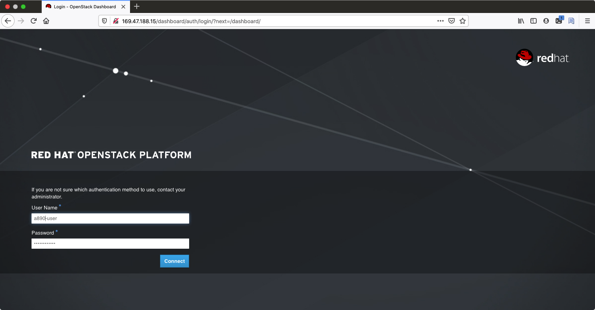

= Configure your environment for running AgnosticD on OpenStack

== Deployment Stages

Deployment can be divided logically into 4 short stages. In the course of this blog we’ll work our way through each stage:

1. Validating the OSP Sandbox instance can communicate with OpenStack
2. Validating the Ansible AgnosticD deployer
3. Creating a python virtualenv for working with OpenStack
4. Preparing your secrets, and credentials, for OpenStack

=== Validating the OSP (OpenStack Platform) Sandbox instance can communicate with OpenStack

Before going further lets just validate your OSP ClientVM (be it your laptop or the bastion machine) can actually talk to an OpenStack Cluster. 

Credentials have been provided to you via email if you have requested access via link:https://labs.opentlc.com[https://labs.opentlc.com] and are also available in your home directory in your bastion machine.

. Please log into your bastion machine as follows:
+
[source,bash]
----
[Cibeles@sassenach:~] $ ssh agilpipp-redhat.com@bastion.a890.red.osp.opentlc.com
----

. Review your `~/.config/openstack/clouds.yaml`:
[source,bash]
----
$ cat ~/.config/openstack/clouds.yaml
clouds:
  GUID-project:
    auth:
      auth_url: "http://YOUR_HORIZON_URL:5000/v3"
      username: "GUID-user"
      project_name: "GUID-project"
      project_id: "YOUR_PROJECT_ID"
      user_domain_name: "Default"
      password: "YOUR_PROVIDED_PASSWORD"
    region_name: "regionOne"
    interface: "public"
    identity_api_version: 3
----

NOTE: Values have been offuscated.

. Execute a simple openstack command. The openstack cli is pre-installed and will pick up both your credentials and API endpoint from `~/.config/openstack/clouds.yaml`.
+
[source,bash]
----
$ openstack project list
----

You should see something similar to this:
[source,bash]
----
+----------------------------------+--------------+
| ID                               | Name         |
+----------------------------------+--------------+
| YOUR_PROJECT_ID                  | a890-project |
+----------------------------------+--------------+
----

You can also inspect your project details by simply running:
[source,bash]
----
$ openstack --os-cloud=GUID-project server list
+--------------------------------------+-----------+--------+--------------------------------------------------+-------+---------+
| ID                                   | Name      | Status | Networks                                         | Image | Flavor  |
+--------------------------------------+-----------+--------+--------------------------------------------------+-------+---------+
| b8e24e81-d500-46d6-bbf3-c327f0b0e92d | bastion   | ACTIVE | a890-testnet-network=192.168.0.30, 169.47.188.96 |       | 2c2g30d |
+--------------------------------------+-----------+--------+--------------------------------------------------+-------+---------+
----

. If the above fails ensure you have both the OpenStack CLI client and a clouds.yaml in `~/config/openstack/clouds.yaml`

. Try to login to OpenStack UI: http://YOUR_HORIZON_URL/dashboard/auth/login/. You must use the credentials from `.config/openstack/clouds.yaml` to login to the UI.

=== Validating the Ansible AgnosticD deployer

. Clone the AgnosticD repository, if not already there:
+
[source,bash]
----
$ git clone https://github.com/redhat-cop/agnosticd
----

. Create your `secrets.yml` file *oustide the repository*, and edit it using the correct credentials based on your `clouds.yml` file. For that, copy the file `agnosticd/ansible/configs/a-base-config/sample_variables/secrets_example_osp.yml` to your desired location (I will use my home directory). And change the appropiate values.
+
[source,bash]
----
[agilpipp-redhat.com@bastion ~]$ cp agnosticd/ansible/configs/a-base-config/sample_variables/secrets_example_osp.yml secrets_osp.yml 
[agilpipp-redhat.com@bastion ~]$ vi secrets_osp.yml 
# Openstack Variables
osp_auth_url: http://YOUR_HORIZON_PROVIDED_URL:5000/v3
osp_auth_username: "{{ guid }}-user"
osp_project_name: "{{ guid }}-project"
osp_project_id: CHANGEME
osp_auth_user_domain: default
osp_auth_password: CHANGEME
osp_auth_project_domain: default

osp_cluster_dns_server: PROVIDED_BY_ADMIN
osp_cluster_dns_zone: PROVIDED_BY_ADMIN
ddns_key_name: PROVIDED_BY_ADMIN
ddns_key_secret: PROVIDED_BY_ADMIN

# Do not create PROJECT, we already have one and want to use it
osp_project_create: false
----

NOTE: You can find a secrets.yaml file provided to you on the home directory of your user at your bastion machine, use this to populate the `PROVIDED_BY_ADMIN` values in the previous example.

[source,bash]
----
[agilpipp-redhat.com@bastion ~]$ ls
agnosticd  openstack  secrets.yml
----

For simplicity go into the agnosticd/ansible directory. You can explore the main playbooks, the roles directory, and the configs directory where AgnosticD gets it’s recipes to deploy both infrastructure and workloads across multiple Cloud Providers and OpenShift.
[source,bash]
----
$ cd agnosticd/ansible
----

=== Test your connection works

Make sure this secret file is correct by running the `test-empty-config`. To test it, simply execute the ansible deployer playbook `main.yml` with the test config called test-empty-config.
[source,bash]
----
$ ansible-playbook main.yml \
  -e @configs/test-empty-config/sample_vars.yml
----

The `-e @configs/test-empty-config/sample_vars.yml` syntax tells ansible-playbook to load the vars in that configs `sample_vars.yml` file. This is a common pattern and used widely with AgnosticD. This is how you will customize your configs going forward.

Expect to see the ansible logs, which may include skipped tasks and plays, complete successfully
[source,bash]
----
<output truncated>
...
PLAY RECAP *************************************************************************************************************
localhost                  : ok=34   changed=3    unreachable=0    failed=0    skipped=19   rescued=0    ignored=0
...
----

Now it's time to test that your configuration allows proper communication with the OpenStack cluster, in order to do so, please run now the playbook with your `secrets.yml` file as follows:
[source,bash]
----
[amaya@bastion ansible]$ ansible-playbook main.yml \ 
  -e @configs/test-empty-config/sample_vars_osp.yml \
  -e @~/secrets.yml
----

At this point we have now confirmed that the Sandbox can both communicate with OpenStack and can also execute an, albeit simple, AgnosticD config which in fact doesn’t create any instances.

=== Creating a Python virtualenv for working with OpenStack

An isolated Python Virtual Environments provides additional functionality and convenient features for configuring, maintaining, duplicating, and troubleshooting the virtual environments. 

`virtualenv` is used to manage Python packages for different projects. Using virtualenv allows you to avoid installing Python packages globally which could break system tools or other projects.

`venv` (for Python 3) and `virtualenv` (for Python 2) allow you to manage separate package installations for different projects. 

They essentially allow you to create a *“virtual” isolated Python installation* and install packages into that virtual installation. 

When you switch projects, you can simply create a new virtual environment and not have to worry about breaking the packages installed in the other environments. 

It is always recommended to use a virtual environment while developing Python applications.

For Sandboxes environments, virtual environments are not needed, but you can find the steps to configure them on your link:https://github.com/redhat-cop/agnosticd/blob/development/training/02_Getting_Started/config_your_linux.adoc[Linux] and link:https://github.com/redhat-cop/agnosticd/blob/development/training/02_Getting_Started/configure_your_mac.adoc[Mac] docs.

. Validate you can communicate, via ansible, with OpenStack.
+
[source,bash]
----
[agilpipp-redhat.com@bastion ansible]$ ansible localhost -m os_auth
----

Expect a successful outcome listing of JSON services and API endpoints with no error message ending similar to this, but with different IP addresses etc:
[source,bash]
----
... <output omitted>
                        "id": "723dd5a9c44147a6942c1760c462bfae",
                        "interface": "admin",
                        "region": "regionOne",
                        "region_id": "regionOne",
                        "url": "http://10.211.62.15:8004/v1/ca3ef1650c6940058d1dd96236fc8619"
                    },
                    {
                        "id": "cc6667ae59dc4a5a8c94c0f23578a5c5",
                        "interface": "internal",
                        "region": "regionOne",
                        "region_id": "regionOne",
                        "url": "http://10.211.62.15:8004/v1/ca3ef1650c6940058d1dd96236fc8619"
                    }
                ],
                "id": "e62a39d2cb0c421b9ccb4e26b837e639",
                "name": "heat",
                "type": "orchestration"
            }
        ]
    },
    "changed": false
}
----

=== Preparing your secrets and credentials for OpenStack

There are a number of ways to find, and authenticate to, OpenStack APIs. So far both the `openstack` and the Ansible ad-hoc command you just executed using the os_auth module found the necessary meta data via a `clouds.yaml` file. In this particular case here: `~/.config/openstack/clouds.yaml`.

Whilst Ansible itself can use `clouds.yaml` via the openstacksdk package you pip installed earlier AgnosticD actually uses a different way of authenticating to OpenStack via vars expressed in YAML. Fortunately your environment has been, largely, pre-configured via a file located at` ~/.secrets.yml` as shown before.

Please make sure your `clouds.yaml` and `secrets.yml` file are present and populated correclty.
[source,bash]
----
[agilpipp-redhat.com@bastion ~]$ ls
agnosticd  openstack  secrets.yml
----

After the previous configuration of the secrets file we did before to test the connection, now it's time to configure the environment repositories method.

The variable `repo_method` in the secrets file defines the method of receiving packages.

. There are three defineable options '*file*', '*rhn*', and '*satellite*'.
.. Defining '*file*' requires a path to the repository typically in url format, that is the `own_repo_path` variable, if you dont' have access to a repo like that (should be provided by admin to a Red Hat employee) just use another method.

.. Defining '*rhn*' registers systems to the Red Hat Network using subscription-manager.

.. Defining '*satellite*' registers systems to an existing Red Hat Satellite server.

NOTE: Define only ONE of the below options. Defining both option 1 & 2 will result in failure.

The Repositories section of your secrets file should look like the following:
[source,bash]
----
[agilpipp-redhat.com@bastion ~]$ vi secrets_osp.yml
## Activation key
repo_method: rhn
rhel_subscription_activation_key: CHANGEME
rhel_subscription_org_id: CHANGEME
rhsm_pool_ids: CHANGEME

## Activation Satellite Server
repo_method: satellite
set_repositories_satellite_hostname: CHANGEME
set_repositories_satellite_ca_rpm_url: CHANGEME
set_repositories_satellite_org: CHANGEME
set_repositories_satellite_activationkey: CHANGEME
----

NOTE: If you are using a yum server via `own_repo_path` or have other sensitive variables for your deployment it makes sense to add them to your new `~/secrets.yml` file. If you are doing a workshop your instructor or facilitator can often supply these.

*Configuration of your environment is now complete.*
