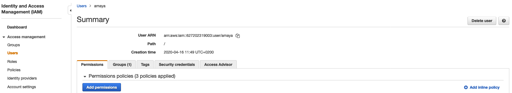
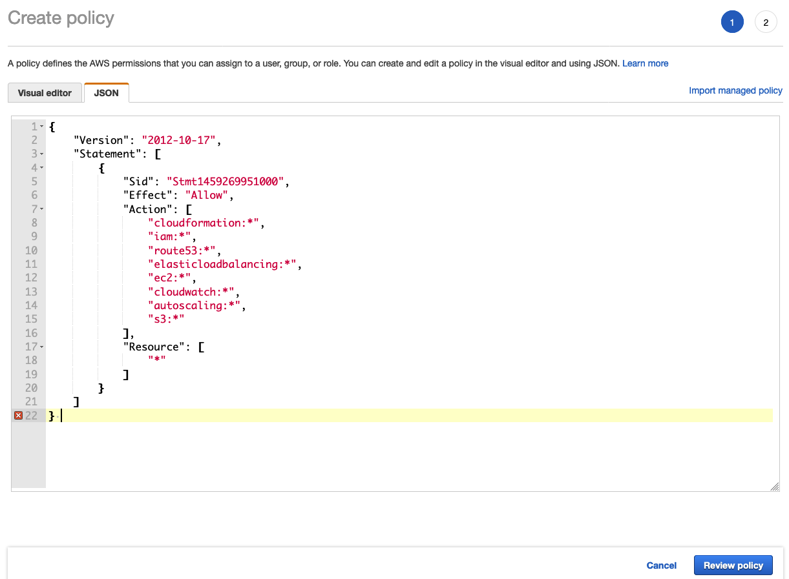

= Configure your environment for running AgnosticD on AWS
This is a configuration guide how your working machine has to be configured in order to be able to deploy AgnosticD on AWS, it mainly covers  the packages and repos you need to install the tools, but a previoulsy existing AWS account is needed.

This guide is focused on Red Hat Enterprise Linux workstation, however, some hints for Mac OS X and Fedora workstations will also be provided (please note these last will be only best efforts based and are unsupported).

== Prerequisites

* https://s3.amazonaws.com/aws-cli/awscli-bundle.zip[awscli bundle] tested with version 1.11.32.

* AWS active account with both programmatic and console access.

* An existing Public Hosted Zone on AWS.

== Steps

Even some of the following packages should have already been installed as explained in https://github.com/redhat-cop/agnosticd/tree/development/training/02_Getting_Started/02_config_your_environment.adoc[Configure your environment] document, I'll go for the full list that is needed for AgnosticD to work with AWS.

. Install base packages
+
[source,bash]
----
$ sudo yum install -y  wget python python-boto unzip python2-boto3.noarch tmux git ansible
----

NOTE: You can also install boto3 with pip, this requires further steps, but those can be used in other platforms, like Mac OS X:

[source,bash]
----
$ git clone git://github.com/boto/boto.git
$ cd boto
$ python setup.py install
$ pip install boto3
----

NOTE: Install pywinrm if you plan to deploy windows VMs (bear in mind that this requires EPEL).

[source,bash]
----
$ cd /tmp
$ wget https://dl.fedoraproject.org/pub/epel/epel-release-latest-7.noarch.rpm
$ sudo yum -y install `ls *epel*.rpm`
$ sudo yum -y install python2-pip.noarch* python3-pip.noarch
$ sudo pip install --upgrade pip
$ sudo pip install pywinrm
----

. Install Ansible
Now, let's install Ansible and checked the installed version (at least, version 2.2.0.0 is required).
+
[source,bash]
----
$ sudo yum install -y ansible
$ ansible --version
ansible 2.9.9
  config file = /etc/ansible/ansible.cfg
  configured module search path = [u'/root/.ansible/plugins/modules', u'/usr/share/ansible/plugins/modules']
  ansible python module location = /usr/lib/python2.7/site-packages/ansible
  executable location = /bin/ansible
  python version = 2.7.5 (default, Jun 11 2019, 14:33:56) [GCC 4.8.5 20150623 (Red Hat 4.8.5-39)] ansible --version
----

. Install AWS CLI
+
[source,bash]
----
$ curl "https://s3.amazonaws.com/aws-cli/awscli-bundle.zip" -o "awscli-bundle.zip"
$ unzip awscli-bundle.zip
$ sudo ./awscli-bundle/install -i /usr/local/aws -b /bin/aws
$ aws --version
aws-cli/1.18.77 Python/2.7.5 Linux/3.10.0-1062.12.1.el7.x86_64 botocore/1.17.0
----

. Mac OS installation steps:
Some of these steps should have already been performed on the document.

.. Install Python3
[source,bash]
----
$ brew install python
----

NOTE: If you prefer to go with python2 just replace `python` with `python@2`

.. Install pip, please note that depending on whether you did python3 or python2, use the pip3 or pip command:
[source,bash]
----
$ pip3 install boto3
----

.. Install Ansible
[source,bash]
----
$ pip3 install ansible
----

.. Install awscli
[source,bash]
----
$ brew install awscli
----

NOTE: If you are running Fedora, all dependencies are packaged and can be easily installed via `dnf install wget git awscli python3-boto3 ansible ansible-lint yamllint` (botocore and python will be pulled automatically through dependencies).
The lint tools are optional but are recommended tools to check the quality of your code.

== Configure the EC2 Credentials

In order to be able to deploy AgnosticD configs on AWS, you will need an IAM user into your AWS account. If you are new to AWS, you can find the link:https://docs.aws.amazon.com/IAM/latest/UserGuide/id_users_create.html[instructions].

. Create your credentials file
You will need to place your EC2 credentials in the ~/.aws/credentials file
+
[source, shell]
----
$ mkdir ~/.aws
$ cat << EOF >>  ~/.aws/credentials
[default]
aws_access_key_id = CHANGE_ME
aws_secret_access_key = CHANGE_ME

EOF
----

. Add the SSH Key to the SSH Agent (optional)
If your operating system has an SSH agent and you are not using your default configured SSH key, you will need to add the private key you use with your EC2 instances to your SSH agent:
+
[source, shell]
----
$ ssh-add <path to key file>
----

NOTE: If you use an SSH config that specifies what keys to use for what hosts this step may not be necessary.

== AWS Permissions and Policies

AWS credentials for the account above must be used with the AWS command line tool. 

. Log into the AWS Console and create an IAM account with the following permissions (policies can be defined for Users, Groups or Roles, in this case, I will create a user policy):

- Navigate to: AWS Dashboard -> Identity & Access Management -> Select Users or Groups or Roles -> Permissions -> Add Inline Policy -> JSON

Choose a name for your policy, (openshift in this case) and paste the following on the JSON tab:
[source,json]
----
{
    "Version": "2012-10-17",
    "Statement": [
        {
            "Sid": "Stmt1459269951000",
            "Effect": "Allow",
            "Action": [
                "cloudformation:*",
                "iam:*",
                "route53:*",
                "elasticloadbalancing:*",
                "ec2:*",
                "cloudwatch:*",
                "autoscaling:*",
                "s3:*"
            ],
            "Resource": [
                "*"
            ]
        }
    ]
}
----

NOTE: Finer-grained permissions are possible, and pull requests are welcome.

== AWS existing resources

=== Route53 DNS

* A route53 link:http://docs.aws.amazon.com/Route53/latest/DeveloperGuide/CreatingHostedZone.html[public hosted zone] is required for the scripts to create the various DNS entries for the resources it creates. Two DNS entries will be created for workshops:
- `master.guid.domain.tld` - a DNS entry pointing to the master
- `*.cloudapps.guid.domain.tld` - a wildcard DNS entry pointing to the router/infrastructure node

NOTE: An EC2 SSH keypair should be created in advance and you should save the key file to your system (our bastion machine in this case). To do so, follow these steps:

[source,bash]
----
$ REGION=us-west-1
$ KEYNAME=ocpworkshop
$ openssl genrsa -out ~/.ssh/${KEYNAME}.pem 2048
$ openssl rsa -in ~/.ssh/${KEYNAME}.pem -pubout > ~/.ssh/${KEYNAME}.pub
$ chmod 400 ~/.ssh/${KEYNAME}.pub
$ chmod 400 ~/.ssh/${KEYNAME}.pem
$ touch ~/.ssh/config
$ chmod 600 ~/.ssh/config
----

Now, test connecting to your AWS account with your previously created credentials and your key:

[source,bash]
---
$ aws ec2 import-key-pair --key-name ${KEYNAME} --region=$REGION --output=text --public-key-material "`cat ~/.ssh/${KEYNAME}.pub | grep -v PUBLIC`"
----
Expect to see something like `ce:55:09:66:74:24:0a:af:2a:6b:37:82:2c:92:2b:e7	a890key	key-0c31ab739ed9003f0` were a890key is ${KEYNAME}.

CAUTION: Key pairs are created per region, you will need to specify a different keypair for each region or duplicate the keypair into every region, you can do something like this:

----
[source,bash]
$ REGIONS="ap-southeast-1 ap-southeast-2 eu-west-1 eu-central-1 OTHER_REGIONS..."
$ for REGION in `echo ${REGIONS}` ;
  do
    aws ec2 import-key-pair --key-name ${KEYNAME} --region=$REGION --output=text --public-key-material "`cat ~/.ssh/${KEYNAME}.pub | grep -v PUBLIC`"
  done
----

== Configuring the AgnosticD resources

. Clone the AgnosticD repository, if not already there:
[source,bash]
----
$ git clone https://github.com/redhat-cop/agnosticd
----

. Create your `secrets.yml` file *oustide the repository* and populate it accordingly:
[source,bash]
----
$ cat << EOF >> ~/secrets.yml
# Authenication for AWS in order to create the things
guid: a890 # for ec2

# repos
repo_method: rhn
rhel_subscription_activation_key: YOUR_ACTIVATION_KEY
rhel_subscription_org_id: YOUR_ORG_ID
rhsm_pool_ids: YOUR_POOL_ID

# aws
aws_access_key_id: YOUR_ACCESS_KEY
aws_secret_access_key: YOUR_SECRET_ACCESS_KEY
EOF
----

NOTE: You can find a `secrets.yml` file provided to you on the home directory of your user at your bastion machine, use this to populate the file as previously stated.
[source,bash]
----
[agilpipp-redhat.com@bastion ~]$ ls
agnosticd  openstack  secrets.yml
----