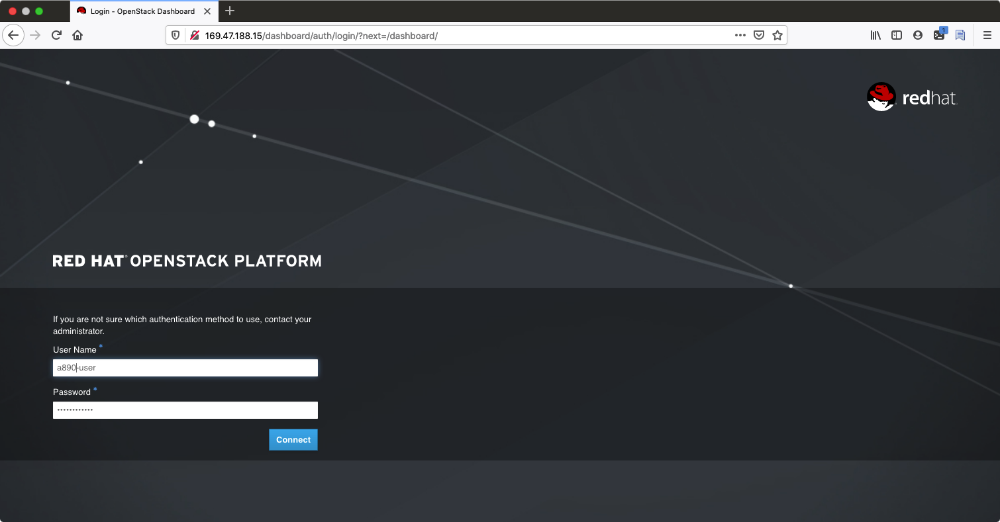
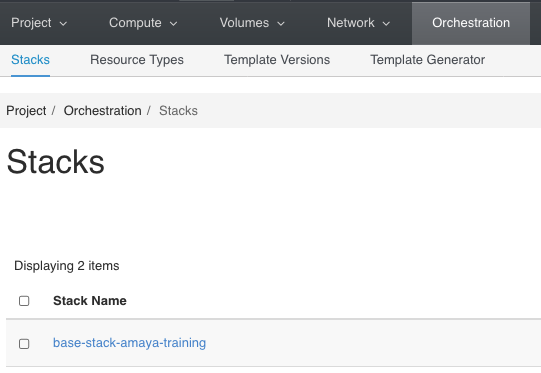
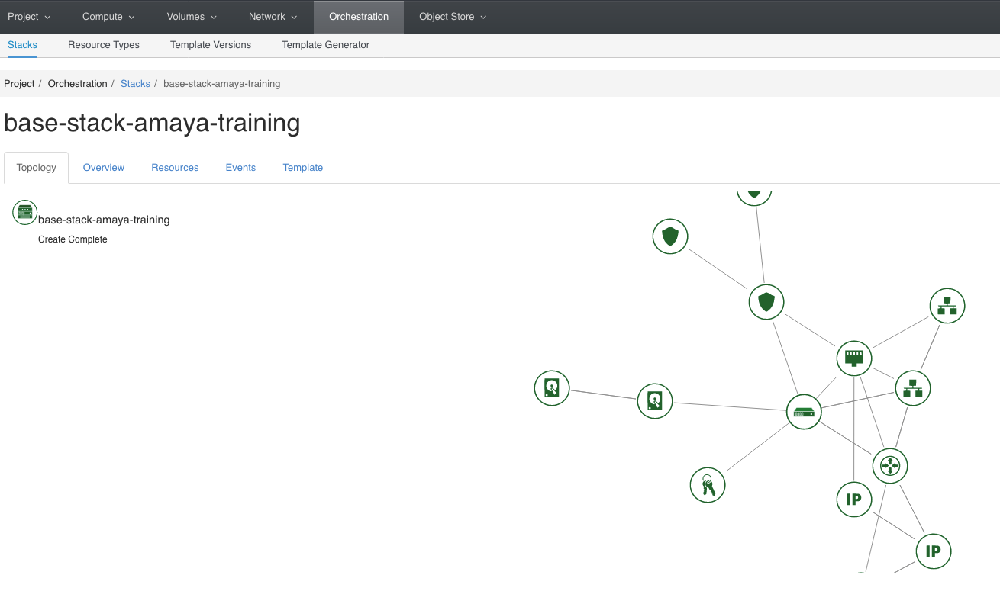
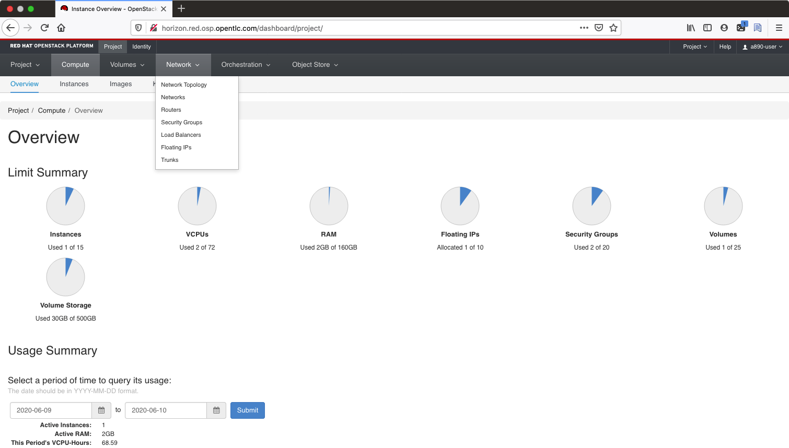
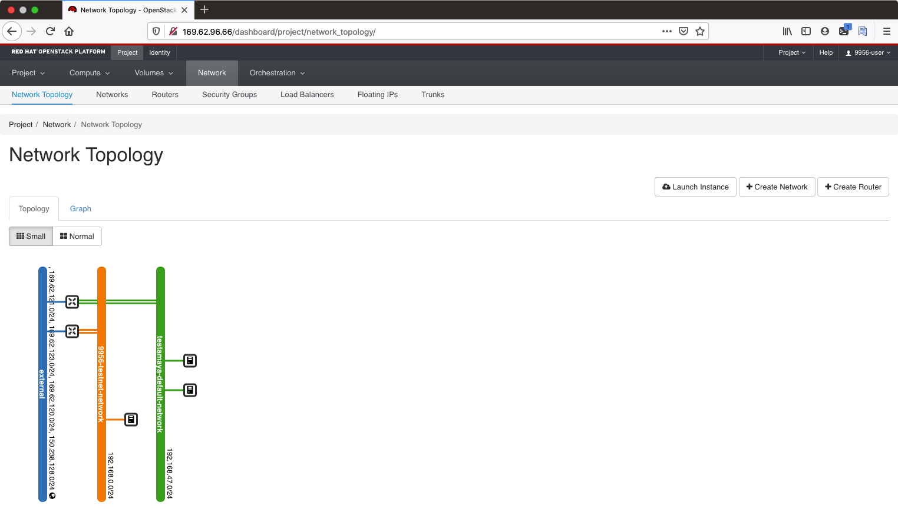

= How to deploy a base config on Agnostic D from an OpenStack Sandbox

Assuming you’ve correctly configured your vars files, it’s time to deploy "a base config".

== Preparing your a-base-config vars
The AgnosticD config `a-base-config` comes with sample vars files included for OpenStack, locally at `~/agnosticd/ansible/configs/a-base-config/sample_variables/rhel8_server_on_osp.yml`. Only a few variables need changed.

. Copy the `rhel8_server_on_osp.yml` file and call it `my_vars.yml`.
+
[source,bash]
----
$ cp configs/a-base-config/sample_variables/rhel8_server_on_osp.yml \
  ~/my_vars.yml
----

. Edit your copy of the vars file, changing the value of guid to a valid subdomain name (For example an alphanumeric string starting with a letter). The values that need changing are identified below:
+
[source,bash]
----
# RHEL 8 Server on OpenStack.
# This example creates a single RHEL 8 server

# Mandatory Variables
cloud_provider: osp                  # This var file is meant for an openstack deployment
env_type: a-base-config              # Name of the config to deploy
software_to_deploy: none             # Not deploying any software onto the environment

# Environment Variables

# guid is the deployment unique identifier, it will be appended to all tags,
# files and anything that identifies this environment from another "just like it"
# The current value is an example guid based on a openstack project name.
guid: CHANGE_ME
email: example@example.com               # User info for notifications
output_dir: /tmp/output_dir              # Writable working scratch directory
admin_user: "{{ guid }}-user"            # User created by the project. Leave as {{ guid }}-user
student_name: "{{ guid }}-user"          # This will be used to create a student login ID
student_password: "r3dh4t1!"             # Customize the student password here. Keep in mind these systems may be public facing.

----

*WARNING*: Do not pick the same *GUID* as the one you got for access to the OSP cluster.	

There are much more variables on the example file, but these are the only ones you need to start deploying AgnosticD.

== Deploy a base config

Execute the main AgnosticD playbook (bear in mind the path to your files, which may differ):
[source,bash]
----
[agilpipp-redhat.com@bastion ansible]$ ansible-playbook main.yml \
   -e @~/my_vars.yml \ 
   -e @~/secrets.yml
----

NOTE: If you are having python2 Vs. Python3 issues, Add `/usr/bin/python3.6` before the ansible-playbook command. For example: `/usr/bin/python3.6 ansible-playbook ansible/main.yml -e @~/my_vars.yml -e@~/secrets.yml`

While your machines are being deployed, you can see the progress from OpenStack web front end called Horizon.
Both your `secrets.yml` and `~/.config/clouds.yml` contain the necessary login information:

. Find your credentials and URL (values may differ):
+
[source,bash]
----
$ cat ~/secrets.yml
guid: CHANGE_ME
osp_project_guid: GUID
osp_auth_url: http://YOUR_HORIZON_URL:5000/v3            (3)
osp_auth_username_member: "{{ osp_project_guid }}-user"  (1)
osp_project_name: "{{ osp_project_guid }}-project"
osp_project_id: YOUR_PROJECT_ID
osp_auth_user_domain: default
osp_auth_password_member: YOUR_PASSWD                    (2)
osp_auth_project_domain: default

osp_cluster_dns_server: ddns01.opentlc.com
osp_cluster_dns_zone: students.osp.opentlc.com
ddns_key_name: PROVIDED_BY_ADMIN
ddns_key_algorithm: PROVIDED_BY_ADMIN
ddns_key_secret: PROVIDED_BY_ADMIN

osp_project_create: false
----

. Browse to the Domain name or IP address in 3 `osp_auth_url` omitting everything from the ":" onwards (in case of a Red Hatter, you can also use the generic URL, http://YOUR_HORIZON_URL).

. Authenticate with the username and password at 1 and 2 above:

. Navigate to tab Orchestration and select Stacks, you will see all your stacks, click on the one you are deploying now, in my case `base-stack-amaya-training`

Now, the creation page will pop up and you will be able to see a graphical representation of all the components we have previously defined, being created, with its values.

== Log into your new node(s)

Congratulations!
You should now have your base config deployed succesfully.

In the logs that scrolled by you may have noticed the IP address of your new bastion server. This, and your other instance(s), have been captured in a temporary working directory, the `output_dir` set in your `~/my_vars.yml` file typically set to `/tmp/output_dir` if you have not changed it previously. This contains, amongst other files, an ssh configuration file.

Append this file to your existing `~/.ssh/config` in the case you are using a sandbox instance:
[source,bash]
----
$ cat /tmp/output_dir/*_ssh_conf >> ~/.ssh/config
----

Now you can ssh to either of your new servers (bastion or node):
[source,bash]
----
$ ssh node
----

You can also log into your machines from the outside world (your laptop) if that is more confortable for you. First locate the public IP addresses of your machines:
[source,bash]
----
[YOUR_USER@bastion ~]$ openstack --os-cloud=${GUID}-project server list

+--------------------------------------+---------+--------+---------------------------------------------------------+-------+---------+
| ID                                   | Name    | Status | Networks                                                | Image | Flavor  |
+--------------------------------------+---------+--------+---------------------------------------------------------+-------+---------+
| 2715f0d9-51e1-4619-a97e-c841914dddf6 | node    | ACTIVE | testamaya-default-network=192.168.47.26                 |       | 2c2g30d |
| 6931bf5a-ec1e-4ac7-8477-9e96f9e14de3 | bastion | ACTIVE | testamaya-default-network=192.168.47.17, 169.47.188.156 |       | 2c2g30d |
| 947d6397-c152-4a38-9825-02f9fa50c03e | bastion | ACTIVE | 98e1-testnet-network=192.168.0.35, 169.47.191.80        |       | 2c2g30d |
+--------------------------------------+---------+--------+---------------------------------------------------------+-------+---------+
----

You can log using your `${GUID}_infra_ssh_key.pem` key file in the `/tmp/output_dir`. Please note that the key file should be copied from the machine you launched the playbook to the machine you want to jump from.
[source,bash]
---- 
sassenach:~ Cibeles$ ssh -i /tmp/output_dir/testamaya_infra_ssh_key.pem cloud-user@169.47.188.156
Last login: Thu May 28 10:49:27 2020 from 90.77.177.210
[cloud-user@bastion 0 ~]$
----

=== See your Deployment from your OSP

. Authenticate with the username and password at 1 and 2 above

. Select the Network Dropdown then Network Topology

. Here you can see your original Sandbox Instance and your new bastion and node, as well as their network attributes:

=== Other important variables

The `rhel8_server_on_ec2.yml` file is full of comments for easier understanding, but since it's also lengthy, here I'll cover some of the most important variables you may find that will allow you to rapidly customize your AgnosticD deployment:

==== Instance Variables
Instance variables will allow you to choose the operating system type and version, as well as the flavor of the osp instance. These are defined on the "instance variables section" as follows:
[source,bash]
----
rhel_image: rhel-8.1                     # Image within OSP to use for systems
node_instance_count: 1                   # The number of nodes to deploy for this environment
node_instance_image: "{{ rhel_image }}"  # Image to use for the node_instance defined in the default_vars.yml
node_instance_type: 2c2g30d              # Existing OSP flavor
node_rootfs_size: 30                     # Size of the root filesystem
----

In order to know where to pull the images from, you can simply run `openstack image list --os-cloud=GUID-project` from your bastion machine to see all the images available.
[source,bash]
----
[agilpipp-redhat.com@bastion ~]$ openstack image list --os-cloud=a890-project |grep -i rhel
| d724a4f9-94d5-47db-8e48-3fbca378aa4f | rhel-8.0-update-3          active |
| 073088b1-9533-4301-9b75-49f9a8760c04 | rhel-8.1                   active |
| 08269fc5-1f16-43e1-abac-346b302ef780 | rhel-8.1-dnsmasq           active |
| 5d108a3c-24f9-45f1-b389-ae106553e0f1 | rhel-server-7.6-update-5   active |
| 93de52d1-2982-43e6-8481-491fc93225e9 | rhel-server-7.7            active |
| 49271e6c-2d3e-4f78-95c8-4cab3c96ac29 | rhel-server-7.7-update-2   active |
----

==== Packages Variables

You can also customize the packages to be installed and repos to be available on your nodes machines, you can find them under the packages section as follows:
[source,bash]
----
rhel_repos:                              # Repositories that will be available in the environment.
  - rhel-8-for-x86_64-baseos-rpms
  - rhel-8-for-x86_64-appstream-rpms

update_packages: false                   # Update all packages on system after configuration. true/false
----

Please note that available repos are linked to your RHN credentials that would have been provided on your secrets file.
[source,bash]
----
common_packages:                         # Packages to be installed on each node
  - unzip
  - bash-completion
  - wget
  - vim-enhanced
----

== Clean up

In order to free resources, when you no longer need your deployment, or if you are making changes (i.e adding more nodes, users, changing the OS, etc.) it is highly recommended that you clean up your previous deployment as follows:

[source,bash]
----
[agilpipp-redhat.com@bastion ansible]$ ansible-playbook destroy.yml \
   -e @~/my_vars.yml \ 
   -e @~/secrets.yml
----

Another way to clean your instances is via OpenStack, simply do `openstack stack delete <stack-name> or <stack-id>` as follows:
[source,bash]
----

[agilpipp-redhat.com@bastion ~]$ openstack --os-cloud=69d3-project stack list
+--------------------------------------+---------------------------+-----------------+----------------------+--------------+
| ID                                   | Stack Name                | Stack Status    | Creation Time        | Updated Time |
+--------------------------------------+---------------------------+-----------------+----------------------+--------------+
| 951ea004-d164-4d44-a1ec-10865a6fe191 | base-stack-amaya-training | CREATE_COMPLETE | 2020-06-19T14:35:51Z | None         |
| 93c65854-7156-4fdb-82dc-19211f4ceb77 | base-stack-a890           | CREATE_COMPLETE | 2020-06-19T12:29:59Z | None         |
+--------------------------------------+---------------------------+-----------------+----------------------+--------------+

[agilpipp-redhat.com@bastion ~]$ openstack stack delete base-stack-amaya-training
----