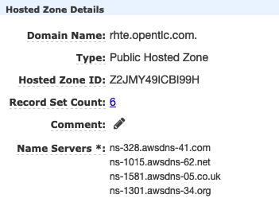
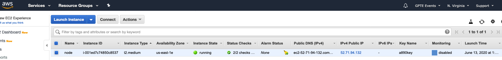
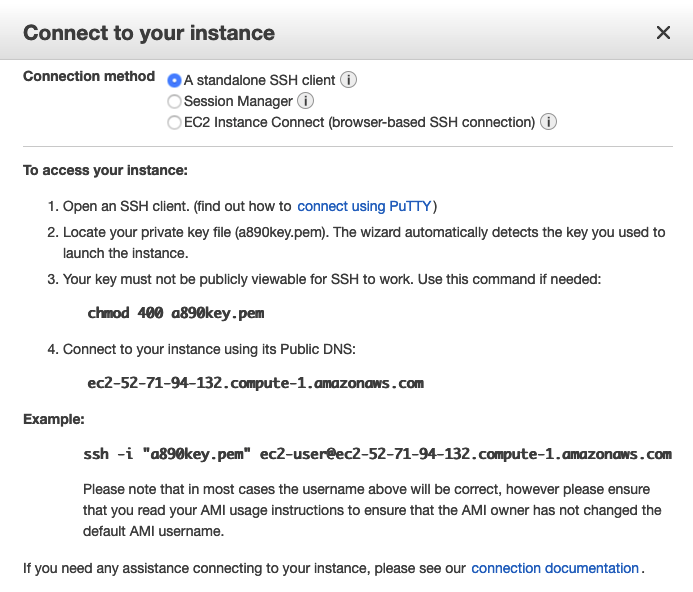

= How to deploy a base config on Agnostic D from an AWS instance

Assuming you’ve correctly configured your vars files, it’s time to deploy "a base config".

== Prerequisites

* AWS active account with both programmatic and console access.

* An existing Public Hosted Zone on AWS.

* Access control and write permissions link:https://docs.aws.amazon.com/Route53/latest/DeveloperGuide/r53-api-permissions-ref.html[on Route 53 API]

== Preparing your a-base-config vars
The AgnosticD config a-base-config comes with sample vars files included for AWS, locally at `~/agnosticd/ansible/configs/a-base-config/sample_variables/rhel8_server_on_ec2.yml`. Only a few variables need changed.

1. Copy the `rhel8_server_on_ec2.yml` file and call it `my_ec2_vars.yml`, or anything you like.
+
[source,bash]
----
$ cp configs/a-base-config/sample_variables/rhel8_server_on_ec2.yml \
  ~/my_ec2_vars.yml
----

2. Edit your copy of the vars file, changing the value of guid to a valid subdomain name (For example an alphanumeric string starting with a letter). The values that need changing are identified below:
+
[source,bash]
----
# sample configuration file
#
# Usage: ansible-playbook main.yml -e @configs/a-base-config/sample.yml
#
# Ideally keep your copy OUTSIDE your repo, especially if using Cloud Credentials

# Mandatory Variables
# -------------------------------------------------------------------
cloud_provider: ec2                  # This var file is meant for an openstack deployment
env_type: a-base-config              # Name of the config to deploy
software_to_deploy: none             # Not deploying any software onto the environment
aws_region: YOUR_AWS_ZONE            # AWS Region to deploy in

node_instance_image: YOUR_IMAGE
# -------------------------------------------------------------------
# Environment Variables

# guid is the deployment unique identifier, it will be appended to all tags,
# files and anything that identifies this environment from another "just like it"
# The current value is an example guid based on a openstack project name.
guid: a890-amaya                         # Unique string used in FQDN
email: example@example.com               # User info for notifications
output_dir: /tmp/output_dir              # Writable working scratch directory
admin_user: "{{ guid }}-user"            # User created by the project. Leave as {{ guid }}-user
student_name: "{{ guid }}-user"          # This will be used to create a student login ID
student_password: "r3dh4t1!"             # Customize the student password here. Keep in mind these systems may be public facing.
key_name: YOUR_SSH_KEY_FILE              # SSH keyname must exist in AWS

### Route 53 Zone ID (AWS)
# This is the Route53 HostedZoneId where you will create your Public DNS entries
#
# HostedZoneId needs to come from the account that is being used. It also needs to match
# subdomain_base_suffix
HostedZoneId: YOUR_ZONE_ID

subdomain_base_short: "{{ guid }}"
subdomain_base_suffix: ".rhte.opentlc.com"
subdomain_base: "{{subdomain_base_short}}{{subdomain_base_suffix}}"

----

NOTE: The `HostedZoneId` value must match the one for your domain.

== Deploy a base config

Execute the main AgnosticD playbook (bear in mind the path to your files, which may differ):
[source,bash]
----
[agilpipp-redhat.com@bastion ansible]$ ansible-playbook main.yml \
   -e @~/my_ec2_vars.yml \ 
   -e @~/secrets.yml
----

NOTE: If you are having python2 Vs. Python3 issues, Add `/usr/bin/python3.6` before the ansible-playbook command. For example: `/usr/bin/python3.6 ansible-playbook ansible/main.yml -e @~/my_vars.yml -e@~/secrets.yml`

== Log into your new node

Congratulations!
You should now have your base config deployed succesfully, please log into your AWS console and find your new node(s):

In the AWS console you may have noticed the public IP address of your new node. This, and your other instance(s), have been captured in a temporary working directory, the `output_dir` set in your `~/my_ec2_vars.yml` file typically set to `/tmp/output_dir` if you have not changed it previously. This contains, amongst other files, an ssh configuration file.

Use this key to ssh into your new node (also, you could use the pem file you previously created and archived on your .ssh directory) using the ec2-user as follows:
[source,bash]
----
$ [agilpipp-redhat.com@bastion ~]$ ssh -i /tmp/output_dir/a890key ec2-user@ec2-52-71-94-132.compute-1.amazonaws.com
[ec2-user@node ~]$
----

=== See your Deployment from your AWS console

Alternatively, if you click on the connect button, all the options are shown:

=== Other important variables

The `rhel8_server_on_ec2.yml` file is full of comments for easier understanding, but since it's also lengthy, here I'll cover some of the most important variables you may find that will allow you to rapidly customize your AgnosticD deployment:

==== Instance Variables
Instance variables will allow you to choose the operating system type and version, as well as the flavor of the ec2 instance. These are defined on the "instance variables section" as follows:
[source,bash]
----
rhel_image: RHEL81                       # Image within ec2 to use for systems
node_instance_count: 1                   # The number of nodes to deploy for this environment
node_instance_image: "{{ rhel_image }}"  # Image to use for the node_instance defined in the default_vars.yml
node_instance_type: t3.medium            # Existing ec2 flavor
node_rootfs_size: 30                     # Size of the root filesystem
----

In order to know where to pull the images from, bear in mind that AWS uses AMI (Amazon Machine Images) but they have long numeric codes for images, so you can find a hash table that matches the name we use (`rhel_image`) and the numeric value AWS uses in `agnosticd/ansible/roles-infra/infra-ec2-template-generate/defaults/main.yml`

==== Packages Variables

You can also customize the packages to be installed and repos to be available on your nodes machines, you can find them under the packages section as follows:
[source,bash]
----
rhel_repos:                              # Repositories that will be available in the environment.
  - rhel-8-for-x86_64-baseos-rpms
  - rhel-8-for-x86_64-appstream-rpms

update_packages: false                   # Update all packages on system after configuration. true/false
----

Please note that available repos are linked to your RHN credentials that would have been provided on your secrets file.
[source,bash]
----
common_packages:                         # Packages to be installed on each node
  - unzip
  - bash-completion
  - wget
  - vim-enhanced
----

== Clean up

In order to free resources, when you no longer need your deployment, or if you are making changes (i.e adding more nodes, users, changing the OS, etc.) it is highly recommended that you clean up your previous deployment as follows:

[source,bash]
----
[agilpipp-redhat.com@bastion ansible]$ ansible-playbook destroy.yml \
   -e @~/my_vars.yml \ 
   -e @~/secrets.yml
----