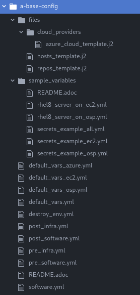

= What is in a Config?

This section models the typical layout of a config using a-base-config as an example.

=== Directory structure of `a-base-config`.

`*files*` +
Contains templates and other files which can be used during deployment.

`*sample_variables*` +
Contains pre-built variable files that will deploy an environment with minimal modification and appropriate credentials.

For example copying `rhel8_server_on_osp.yml` & `secrets_example_osp.yml` and making minor modifications to the variable files will deploy a RHEL 8 server to Openstack.

`*default_***.yml*` +
Files with this prefix are automatically included when the config is executed. These exist to define the minimum variables for the config to successfully deploy.

Generally you will not need to edit these files as the variables will be overwritten by any file included with `-e` in the `ansible-playbook` runtime.

`*_infra.yml*` *&* `*_software.yml*` +
These suffixes indicate files of the 5 development playbooks consistent through every config in agnosticD.

`*secret.yml*` +
secret.yml normally lives in your home direcotry - anywhere outside of the AgnosticD repository itself. They should never be committed to Git!

Example secret files include:
[source,bash]
----
osp_auth_username: alice
osp_auth_password: toomanysecrets
[ ...]
----

You can see that these are sensitive credentials.

When running AgnosticD, it’s normal to "pass in" your secrets like this;

[source,bash]
----
user@host: ansible-playbook main.yml -e@~/secret.yml -e@configs/...
----

For a reminder of this process, and what is typically deployed in each review the diagram on https://github.com/redhat-cop/agnosticd/blob/development/README.adoc[How AgnosticD Deploys]
