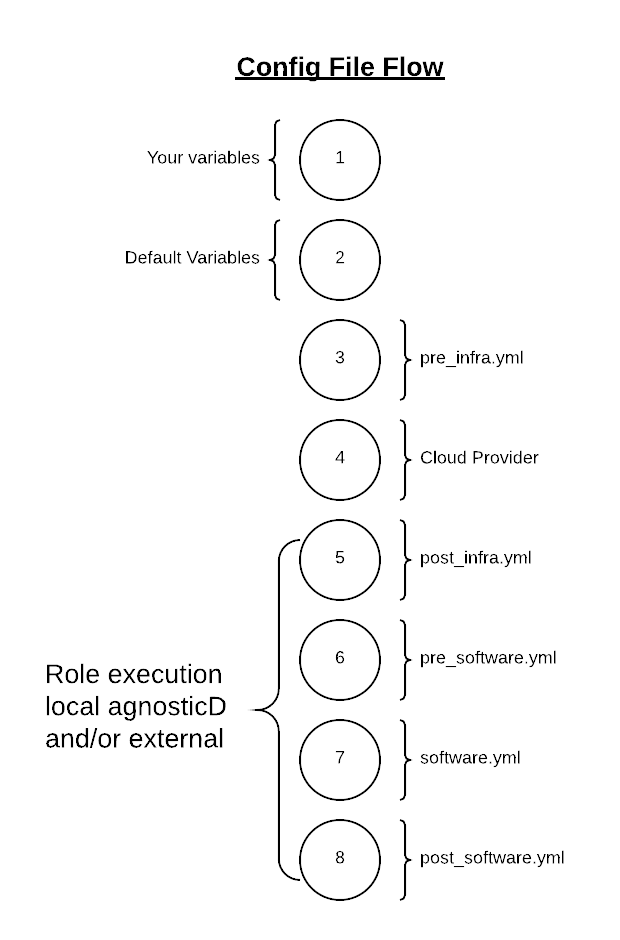
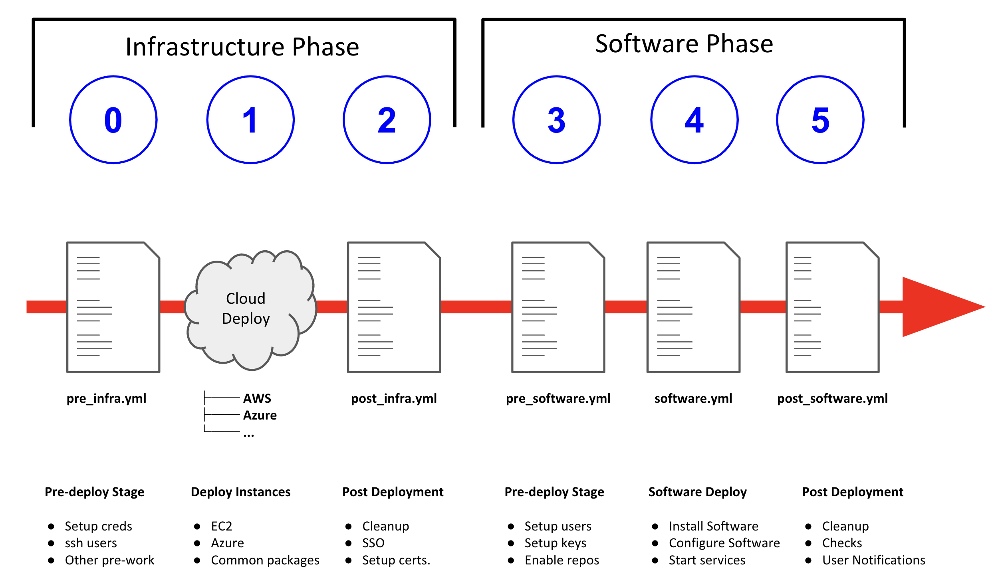

= What Happens When Deploying

AgnosticD deploys configs via a 6 stage process. This provides config creators considerable flexibility, without undue complexity, to control the deployment process in a modular manner and enables you to abstract the Cloud Specific steps (e.g. AWS ec2 or Microsoft Azure) from the application or OS specific steps. Greatly enhancing Cloud Portability.

The last point is key, as it allows developers to simply add new Cloud Platforms at a latter date, or provide their configs with multi-cloud support from day 1. The term Cloud Provider includes the ability to add a virtualization platform (e.g. KVM, Hyper-V), Public Cloud Platform (e.g. Google Cloud Engine), or a container based platform such as OpenShift or Docker.

Currently supported platforms (via Cloud Providers):

* Openstack
* AWS EC2
* Azure

When ansible starts to deploy a config the process involves 2 logically distinct phases, Infrastructure and Software, each broken up into 3 Steps. This is illustrated below:

AAD deployments start by invoking a common main.yml with an environmental variable file identifying the cloud platform to deploy plus other meta-data.

e.g. ansible-playbook main.yml -e @configs/three-tier-app/sample_vars.yml

Simplified execution flow of main.yml
[source,bash]
----
- import_playbook: "configs/{{ env_type }}/pre_infra.yml"
- import_playbook: "cloud_providers/{{ cloud_provider }}_infrastructure_deployment.yml"
- import_playbook: "configs/{{ env_type }}/post_infra.yml"
- import_playbook: "configs/{{ env_type }}/pre_software.yml"
- import_playbook: "configs/{{ env_type }}/software.yml"
- import_playbook: "configs/{{ env_type }}/post_software.yml"
----

For config developers the above stages provide 5 hooks for customizing the configuration of your environment and 1 hook for customizing it for one or more cloud providers (e.g. AWS, Azure, etc).

An example config is provided by `ansible/configs/a-base-config`

== Stage 0 pre_infra.yml
In this stage AAD is the entry playbook and is typical used for setting up any infrastructure etc prior to launching a cloud deployment. Typical tasks could include:

* Creating necessary ssh keys
* Moving any ssh keys into place, setting permissions etc
* Creating any payloads to be used in later stages e.g. repo files etc
* Ensuring cloud credentials are available

== Stage 1 Cloud Provider Deploy
This stage is unique in the flow in that the config creator doesn’t supply a playbook but typically has to provide cloud specific configuration data.

Clouds are selected via the value of the cloud_provider variable and supported clouds can be found in `ansible/cloud_providers`. Currently supported are:

* Openstack
* Amazon Web Services (AWS)
* Microsoft Azure

== Stage 2 post_infra.yml
In this stage AgnosticD can execute any "post infrastructure" tasks. It is not uncommon for this phase to do nothing but it provides a convenient hook for any tasks that may need to be run after building your Cloud Infrastructure. For example running any smoke tests that may be required.

== Stage 3 pre_software.yml
At this point the infrastructure should be up and running but typically in a un-configured state. This stage provides a convenient hook for running any tasks that may be needed before software payload deployment. For example"

* Running any pre software tests
* Setup software dependant yum repos or equivalent
* Retrieving any licenses etc.
* ssh key housekeeping - for example inserting additional keys and configuration
* Prepare bastion hosts or jumpboxes

== Stage 4 software.yml
In this stage AgnosticD deploys any software payloads onto the infrastructure. This could be as simple as installing Apache or as complex as installing and configuring an N-tier application.

== Stage 5 post_software.yml
In the final stage AgnosticD would typically perform a number of tasks including:

* Any cleanup from the prior stages
* Any end to end or component testing
* User notification of the running configuration