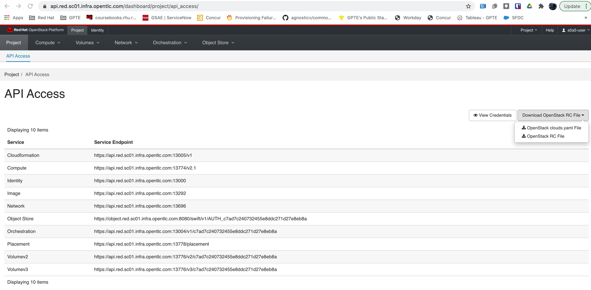

= Variables deep dive
One very important aspect of AgnosticD are variables, and particularly where to define them, how to use them and what they are valid for.

There are a number of variables that are required when deploying and / or creating an infrastructure config. Some other variables are simply generally used and some others are specific to the cloud provider the config is deployed in.

Let’s cover all this in detail.

= Where to place Variables

There are different places where you can define your variables, bearing in mind always the precedence in ansible (further info at https://docs.ansible.com/ansible/latest/reference_appendices/general_precedence.html).

The most commonly used files to instantiate your variables to be used in AgnosticD are: 
Secrets file: file to declare variables that should not be seen or shared with others (in our case, variables we don’t want to be on the publicly accessible AgnosticD git repo). Typically, this is called the secrets.yaml file.
Variables files: parametrization file with your desired values. This will be the variables you need to re-define in order to override default values (normally explained on the README files in every config). Typically, this file is called my_vars.yaml.
Command line: Variables passed on the command line, normally for testing, these will take the higher preference. Specified with “-e”

= Generally used infra variables
Typically, when defining an infrastructure config, you’d need to set the following types of variables:

*1. Core required variables*: minimum set of variables needed to deploy an AgnosticD config.

*2. Environment variables*: variables that apply to the particular environment you are going to deploy (guid, student name, student password, etc).

*3. Network variables*: list of the private networks and subnets to create in the project. You can create as many as you want, but at least one is required. Use the name of the networks where appropriate in the instance list.

*4. Firewall rules*: which in AgnosticD is called “security groups”.
Instance variables: Instances to be provisioned in project. These have to be provided as a list. Each instance type can have any number of replicas deployed with the same configuration. Metadata in OpenStack is equivalent to tags in AWS. Note that these instances will be created with Cinder persistent volumes.

A good example of typically used infrastructure variables can be seen on the 
`configs/a-base-config/sample_variables/rhel8_server_on_osp.yml` file. This file has been created for learning purposes and is fully commented, for easier understanding.

= Core Required Variables

[options="header",cols="1,4"]
|============================
| Name
| Description

| `cloud_provider`
| Cloud provider.
Required variable, but may be set to `none` where not applicable.

| `env_type`
| Config name which should match to a subdirectory under `ansible/configs/`.

| `guid`
| Unique ID used in labels, tags, metadata, and resource naming throughout the config to identify resources and prevent conflicts.

| `ACTION`
| Action to be performed by the lifecycle playbook or workload.

| `output_dir`
| Directory where output files are stored. Need to exist on the launching machine with write permissions.

| `email`
| User email for notifications.
|============================

= Secrets Variables

Within the secrets variables, there are 2 types:

*1. General variables:* the ones that apply to the chosen cloud provider.

*2. Cloud variables:* the ones that apply to any of the clouds you want to deploy. Normally, these are services that you’d need, like credentials on a Satellite or Tower server.

== General Secrets Variables
In this document we are going to cover the 2 major cloud providers being currently used on AgnosticD deployments, Openstack and AWS.

=== Openstack
You need to specify the secret variables that are needed to use the instance Openstack has provided to you.

Most of these openstack secrets can be attained through the clouds.yaml file from the horizon web ui under "Project" -> "api access" -> "Download RC file" -> "clouds.yaml" If you are testing within a sandbox these will be provided for you.

In addition, they have also been emailed to you when you ordered a sandbox, and also in that sandbox at `~/.config/openstack/clouds.yaml`.

In addition to above, you’ll also need some other variables that can be found in your ~/.secrets.yaml file on your sandbox.

The usage of these sets of variables has been covered on the foundational level of this training, at link:https://github.com/redhat-cop/agnosticd/blob/development/training/02_Getting_Started/03_config_env_osp.adoc[Configure your environment for running AgnosticD on OpenStack] 

=== AWS

You will need to specifyu the credentials to access AWS API if you have an account.

aws_access_key_id: 
aws_secret_access_key:

== Cloud Secrets Variables
These are the variables that allow you to connect to other services, a typical case here is the provisioning method for your machines, it can be 3 different methods, specified by the *`repo_method`* variable:

*1. file:* Defining 'file' requires a path to the repository typically in url format. own_repo_path explaination,if no access use other methods.

*2. rhn:* Defining 'rhn' registers systems to the Red Hat Customer Portal using subscription-manager. Define only ONE of the 2 options, credentials and activation key. Defining both, will result in failure.

    - *Option 1*, using your Red Hat Customer Portal account credentials.

        - *rhel_subscription_user*: Your Red Hat Customer Portal user account login.

        - *rhel_subscription_pass*: Your Red Hat Customer Portal user account password.

        - *rhsm_pool_ids*: Your chosen pool ID.

    - *Option 2*, unsing an activation key.

        - *rhel_subscription_activation_key*: Your activation key.

        - *rhel_subscription_org_id*: Your activation key organization ID.

        - *rhsm_pool_ids*: Your chosen pool ID.

        - *satellite*: Defining 'satellite' registers systems to an existing Red Hat Satellite server.

        - *set_repositories_satellite_hostname*: Hostname of satellite server.

        - *set_repositories_satellite_org*: CA certificate used to validate satellite server TLS.

        - *set_repositories_satellite_ca_rpm_url*: URL to download the Katello/Satellite CA certificate configuration RPM.

        - *set_repositories_satellite_activationkey*: Activation key to register to satellite.

= Config's variable files:

Most configs within AgnosticD have sample variable files in their directory structure. These will help guide you to the basic variables required, in the case of the config  used in this training (a base config) you can find those at `agnosticd/ansible/configs/a-base-config/`sample_variables as shown:

[source,bash]
----
[Cibeles@sassenach:~/repos/agnosticd/ansible/configs/a-base-config/sample_variables] $ ll                                                               
-rw-r--r--  1 Cibeles  staff   381B Feb 19 11:52 README.adoc
-rw-r--r--  1 Cibeles  staff   5.2K Feb 19 11:52 rhel8_server_on_ec2.yml
-rw-r--r--  1 Cibeles  staff   5.5K Feb 19 11:52 rhel8_server_on_osp.yml
-rw-r--r--  1 Cibeles  staff   2.8K Feb 19 11:52 secrets_example_all.yml
-rw-r--r--  1 Cibeles  staff   1.7K Feb 19 11:52 secrets_example_ec2.yml
-rw-r--r--  1 Cibeles  staff   1.8K Feb 19 11:52 secrets_example_osp.yml
----

Another good tip for you to find where variables are mapped is to use the "`grep`" command to find variables and where they are mentioned in the background roles.

From the `ansible/` directory we can recursively search for variable names to find where they are being used or defined.

Example:

[source,bash]
----
[Cibeles@sassenach:~/repos/agnosticd/ansible/configs/a-base-config] $ grep grep -R cloud_provider *                                     
destroy_env.yml:  import_playbook: ../../cloud_providers/{{cloud_provider}}_destroy_env.yml
files/cloud_providers/azure_cloud_template.j2:                    "vmSize" : "{{instance['flavor'][cloud_provider]}}"
files/ssh_config.j2:  
files/ssh_config.j2:  
sample_variables/rhel8_server_on_osp.yml:cloud_provider: osp                  # This specifies deployment to Openstack
sample_variables/secrets_example_all.yml:# cloud_provider: CHANGEME                       # 'osp', 'ec2', or 'azure'
sample_variables/rhel8_server_on_ec2.yml:cloud_provider: ec2                  # This var file is meant for an openstack deployment
----