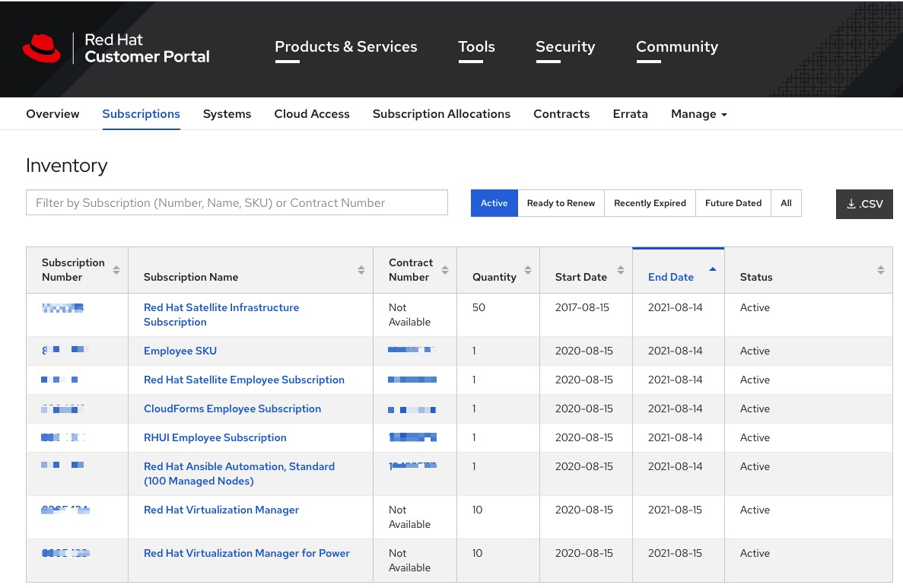
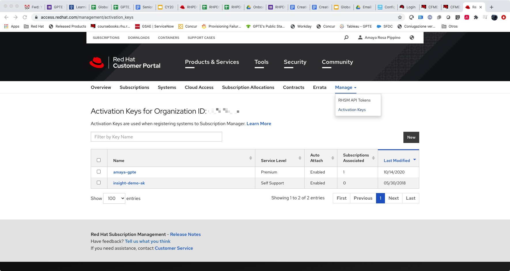
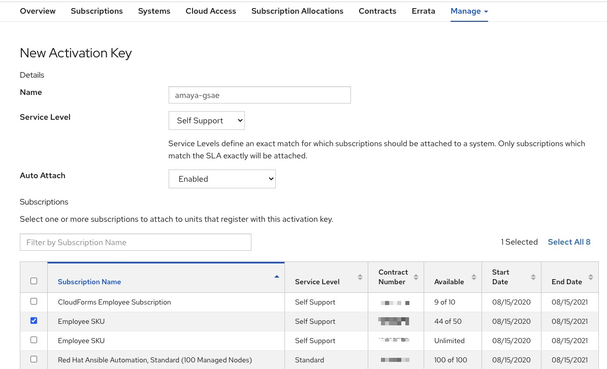

= Create your own Activation Key

As explained, you can use your own RHN activation key that you can create at link:https://access.redhat.com/[https://access.redhat.com/].

The process is very simple, just log into link:https://access.redhat.com/[https://access.redhat.com/] with your RHN account.

Click on Subscriptions and on the Subscriptions tab you can see all the subscriptions you have available on your account (please note numbers have been obfuscated)

Then click on the manage tab and create a new activation key:

Create a new activation key, by clicking on the New button, and fill the fields appropiately. Make sure you choose the correct subscription that matches your needs.

Once your activaction key has been created, you simply need to use it accordingly, by gathering your activation key name, your organization and pool id into your `secrets.yaml` file:

[source,bash]
---- 
rhel_subscription_activation_key: amaya-gsae
rhel_subscription_org_id: XXXXXX
rhsm_pool_ids: XXXXXXXXXXXXX
----

The pool id can be seen under Subscriptions tab, and there, click on the subscription number that matches the subscription you just used to create your activation key. Please note you'd need to use the "Derived Pool".

image::../images/pool_id.jpg[Pool ID to use]